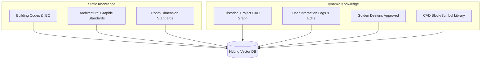
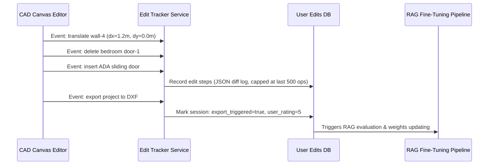
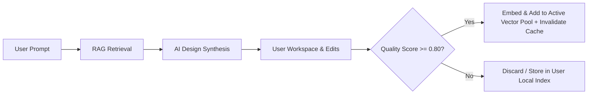

# Domain-Specific Architectural CAD RAG: System Architecture Design

This document details the system design, data schemas, mathematical formulations, and engineering architecture for a production-grade CAD RAG system tailored for AI-powered architectural layout generation.

---

## Part 1 - Knowledge Sources & Lifecycle

To ensure precise spatial synthesis and compliance, the system divides knowledge assets into static regulatory reference data and dynamic, user-evolving layout repositories.



### 1. Static Reference Data (Read-Only)
- **Building Regulations**: International Building Code (IBC), local fire safety compliance acts, accessibility standards (ADA). Updated occasionally (e.g., yearly/triennially).
- **Design Guidelines**: Neufert Architects' Data, Architectural Graphic Standards. These define functional layouts (e.g., kitchen triangle efficiency, clearances).
- **Standard Room Dimensions**: Minimum area requirements (e.g., habitable rooms $\ge 70\text{ sq ft}$ or $6.5\text{ m}^2$) and standard ceiling heights.

### 2. Dynamic Operational Data (Read-Write / Event-Driven)
- **Historical Completed Projects**: Full scale drawings exported, archived, or built. Automatically converted to structural graphs and indexed.
- **User Layout Edits**: Real-time canvas logs tracking element translations, deletions, and structural overrides.
- **Architect-Approved "Golden" Layouts**: Verified layouts hand-labeled by senior architects as design patterns.
- **CAD Components (Blocks Library)**: Modular elements (toilets, furniture, windows, doors) with insertion points, alignment tags, and local geometry.

---

## Part 2 - Database Schema Design (PostgreSQL / pgvector)

We utilize a PostgreSQL database equipped with `pgvector` to run relational metadata queries and vector similarity searches concurrently. Full-text BM25 search is served via PostgreSQL's native `tsvector` + GIN indexes (no external search engine required for MVP).

> **Integration note**: The existing backend uses migration files `001–004_*.sql`. The RAG schema is added as `005_rag_mvp.sql` so it layers onto the current `organizations` / `users` tables without modifying them. The `tenant_id` column in all RAG tables maps to `organizations.id`.

```sql
-- 005_rag_mvp.sql

-- Enable required extensions
CREATE EXTENSION IF NOT EXISTS vector;
CREATE EXTENSION IF NOT EXISTS pg_trgm;  -- required for BM25-style trigram search

-- 1. Knowledge Chunks Table (Building codes, standards, text guidelines)
CREATE TABLE knowledge_chunks (
    id UUID PRIMARY KEY DEFAULT gen_random_uuid(),
    tenant_id UUID NOT NULL REFERENCES organizations(id) ON DELETE CASCADE,
    document_title VARCHAR(255) NOT NULL,
    section_identifier VARCHAR(100) NOT NULL,
    content TEXT NOT NULL,
    embedding VECTOR(1536) NOT NULL,
    tsv tsvector GENERATED ALWAYS AS (to_tsvector('english', content)) STORED,
    metadata JSONB NOT NULL DEFAULT '{}',
    created_at TIMESTAMPTZ DEFAULT NOW()
);

-- 2. CAD Component Library (Blocks, symbols, doors, windows)
CREATE TABLE cad_components (
    id UUID PRIMARY KEY DEFAULT gen_random_uuid(),
    tenant_id UUID NOT NULL REFERENCES organizations(id) ON DELETE CASCADE,
    component_name VARCHAR(100) NOT NULL,
    category VARCHAR(50) NOT NULL, -- furniture, door, window, toilet, etc.
    svg_representation TEXT,
    geometry_data JSONB NOT NULL, -- anchor points, dimensions, bounding box
    tags TEXT[] NOT NULL DEFAULT '{}',
    embedding VECTOR(1536) NOT NULL,
    created_at TIMESTAMPTZ DEFAULT NOW()
);

-- 3. Building Rules & Thresholds (Structured rules for procedural verification)
--
-- evaluator_rule is NOT free-form text to avoid eval() security risks.
-- Instead, rule_type is an enum and parameters is a typed JSONB payload.
-- The rule engine interprets the combination — no arbitrary code is executed.
--
-- Supported rule_type values:
--   "min_area"        → parameters: { "element": "bedroom", "value_m2": 6.5 }
--   "min_width"       → parameters: { "element": "corridor", "value_mm": 914 }
--   "max_occupancy"   → parameters: { "element": "room", "persons": 50 }
--   "egress_count"    → parameters: { "floor_area_m2": 280, "min_exits": 2 }
--   "door_swing_clearance" → parameters: { "min_clear_mm": 900 }
CREATE TABLE building_rules (
    id UUID PRIMARY KEY DEFAULT gen_random_uuid(),
    tenant_id UUID NOT NULL REFERENCES organizations(id) ON DELETE CASCADE,
    jurisdiction VARCHAR(100) NOT NULL,
    rule_category VARCHAR(100) NOT NULL, -- fire_safety, dimensioning, parking
    target_element VARCHAR(50) NOT NULL, -- wall, bedroom, exit_door
    rule_type VARCHAR(50) NOT NULL CHECK (rule_type IN (
        'min_area', 'min_width', 'max_occupancy', 'egress_count', 'door_swing_clearance'
    )),
    parameters JSONB NOT NULL,           -- typed payload; interpreted by rule engine, never eval()'d
    description TEXT NOT NULL,
    severity VARCHAR(20) NOT NULL CHECK (severity IN ('info', 'warning', 'critical')),
    created_at TIMESTAMPTZ DEFAULT NOW()
);

-- 4. Historical Projects (Full layout structures)
CREATE TABLE historical_projects (
    id UUID PRIMARY KEY DEFAULT gen_random_uuid(),
    tenant_id UUID NOT NULL REFERENCES organizations(id) ON DELETE CASCADE,
    project_name VARCHAR(100) NOT NULL,
    footprint_width NUMERIC NOT NULL,
    footprint_length NUMERIC NOT NULL,
    room_count INTEGER NOT NULL,
    style_tag VARCHAR(50) NOT NULL, -- modern, industrial, classic
    graph_representation JSONB NOT NULL, -- structural room-adjacency graph
    geometry_json JSONB NOT NULL,        -- full coordinates array
    dxf_data BYTEA,
    project_embedding VECTOR(1536) NOT NULL,
    quality_score NUMERIC DEFAULT 0.0 CHECK (quality_score BETWEEN 0 AND 1),
    created_at TIMESTAMPTZ DEFAULT NOW()
);

-- 5. User Edit Sessions (History tracking changes from initial AI draft to final user layout)
--    operations_log is capped at the last 500 actions per session to bound row size.
--    Sessions older than 90 days without export_triggered=true are cleaned up by a scheduled job.
CREATE TABLE user_edits (
    id UUID PRIMARY KEY DEFAULT gen_random_uuid(),
    project_id UUID REFERENCES historical_projects(id) ON DELETE CASCADE,
    tenant_id UUID NOT NULL REFERENCES organizations(id) ON DELETE CASCADE,
    user_id UUID NOT NULL REFERENCES users(id) ON DELETE CASCADE,
    initial_ai_elements JSONB NOT NULL,
    final_user_elements JSONB NOT NULL,
    operations_log JSONB NOT NULL DEFAULT '[]', -- last 500 user actions, see schema in Part 7
    number_of_edits INTEGER NOT NULL DEFAULT 0,
    export_triggered BOOLEAN DEFAULT FALSE,
    user_rating INTEGER CHECK (user_rating BETWEEN 1 AND 5),
    created_at TIMESTAMPTZ DEFAULT NOW(),
    updated_at TIMESTAMPTZ DEFAULT NOW()
);

-- 6. Design Templates (Skeletal layouts without detailed blocks)
CREATE TABLE design_templates (
    id UUID PRIMARY KEY DEFAULT gen_random_uuid(),
    tenant_id UUID NOT NULL REFERENCES organizations(id) ON DELETE CASCADE,
    template_name VARCHAR(100) NOT NULL,
    room_topology JSONB NOT NULL, -- skeletal layout mapping space connections
    embedding VECTOR(1536) NOT NULL,
    created_at TIMESTAMPTZ DEFAULT NOW()
);

-- 7. Golden Designs (Curated reference standards)
--    embedding is stored directly (not derived via FK) so the golden record
--    remains valid even if the source project is later archived or deleted.
CREATE TABLE golden_designs (
    id UUID PRIMARY KEY DEFAULT gen_random_uuid(),
    tenant_id UUID NOT NULL REFERENCES organizations(id) ON DELETE CASCADE,
    source_project_id UUID REFERENCES historical_projects(id) ON DELETE SET NULL,
    architect_reviewer_id UUID NOT NULL REFERENCES users(id),
    review_comments TEXT,
    verified_compliance_rules TEXT[] NOT NULL DEFAULT '{}',
    embedding VECTOR(1536) NOT NULL,  -- copied from source_project at promotion time
    created_at TIMESTAMPTZ DEFAULT NOW()
);

-- ─── Indexes ──────────────────────────────────────────────────────────────────

-- Tenant isolation (all RAG tables)
CREATE INDEX idx_chunks_tenant      ON knowledge_chunks(tenant_id);
CREATE INDEX idx_components_tenant  ON cad_components(tenant_id);
CREATE INDEX idx_rules_tenant       ON building_rules(tenant_id);
CREATE INDEX idx_projects_tenant    ON historical_projects(tenant_id);
CREATE INDEX idx_edits_tenant       ON user_edits(tenant_id);
CREATE INDEX idx_golden_tenant      ON golden_designs(tenant_id);

-- Dimensional filter (used by metadata pre-filter in retrieval)
CREATE INDEX idx_projects_geometry  ON historical_projects(footprint_width, footprint_length);
CREATE INDEX idx_projects_style     ON historical_projects(style_tag);
CREATE INDEX idx_edits_project      ON user_edits(project_id);
CREATE INDEX idx_edits_user         ON user_edits(user_id);

-- Vector similarity (HNSW — all embeddable tables)
--
-- ⚠️ HNSW memory note: HNSW builds an in-memory graph; high m / ef_construction
-- values increase recall but consume RAM proportionally. At tens of thousands of
-- drawings per tenant, untuned indexes can exhaust PostgreSQL shared_buffers.
-- Use m=16, ef_construction=64 as the baseline (good recall, manageable RAM).
-- Increase ef_construction to 128 only on the golden_designs table (small, high-value).
-- Ensure shared_buffers >= 25% of total RAM and work_mem is set conservatively.
CREATE INDEX idx_chunks_vector     ON knowledge_chunks    USING hnsw (embedding vector_cosine_ops) WITH (m = 16, ef_construction = 64);
CREATE INDEX idx_projects_vector   ON historical_projects USING hnsw (project_embedding vector_cosine_ops) WITH (m = 16, ef_construction = 64);
CREATE INDEX idx_components_vector ON cad_components      USING hnsw (embedding vector_cosine_ops) WITH (m = 16, ef_construction = 64);
CREATE INDEX idx_templates_vector  ON design_templates    USING hnsw (embedding vector_cosine_ops) WITH (m = 16, ef_construction = 64);
CREATE INDEX idx_golden_vector     ON golden_designs      USING hnsw (embedding vector_cosine_ops) WITH (m = 16, ef_construction = 128);

-- Full-text BM25 (GIN on generated tsvector)
CREATE INDEX idx_chunks_fts        ON knowledge_chunks USING gin(tsv);
CREATE INDEX idx_rules_fts         ON building_rules   USING gin(to_tsvector('english', description));
```

---

## Part 3 - Chunking Strategy

Standard token-based or character-based chunking degrades performance for structured regulatory codes and drawings. We use a context-preserving semantic partitioner:

### 1. Document & Building Codes Partitioning
- **Chunking Method**: Outline/Clause-level semantic chunking. We split on specific clause numbers (`Section 1008.1.1`, `Sub-clause A`).
- **Target Size**: 200–500 tokens.
- **Context injection**: Inject the parent outline path into every chunk's text representation.
  - *Example Content*:
    `[IBC 2024 -> Chapter 10 "Means of Egress" -> Section 1008 -> Clause 1008.1.1] Minimum width of corridor is 36 inches (914 mm) where serving an occupancy of less than 50.`

### 2. CAD Drawing & Layout Partitioning
Vector drawings are chunked using spatial hierarchy:

- **Spatial Bounding Boxes**: Slice full CAD projects into overlapping 10m × 10m spatial regions. Stride is 5m (50% overlap) so localized clusters (e.g., toilet layout) always appear whole in at least one chunk. Overlap trades index size for retrieval recall — adjust stride to 7.5m (25% overlap) once data volume grows.
- **Semantic Rooms / Zones (Entity-Adjacency Graph)**: Extract topological subgraphs (e.g., Master Suite containing Master Bedroom node, Closet node, and Bathroom node connected by door portals).
- **Block Definitions**: Symbol geometry is chunked individually, associating raw coordinates with tag labels (e.g., standard ADA shower block).

```json
{
  "chunk_id": "chunk-bed-suite-104",
  "type": "layout_subgraph",
  "bounding_box": {"x1": 0, "y1": 0, "x2": 6.5, "y2": 5.0},
  "stride_m": 5.0,
  "rooms": ["master_bedroom", "master_bath", "walkin_closet"],
  "connections": [
    {"from": "master_bedroom", "to": "master_bath", "portal": "sliding_door"},
    {"from": "master_bedroom", "to": "walkin_closet", "portal": "pocket_door"}
  ]
}
```

---

## Part 4 - Embedding Strategy

### Phase 1–3: Text Linearization + OpenAI Embeddings (Practical Default)

For MVP through architect feedback phases, geometric layouts are serialized into a normalized DSL string and embedded with `text-embedding-3-large`. This avoids the ML research cost of a custom GNN while still enabling useful semantic retrieval.

```
       Text Query ──────────────────────────────────────┐
                                                         ▼
  CAD Layout (linearized DSL) → [ text-embedding-3-large ] → Vector Space (1536-dim)
                                                         │
                                                  (Cosine Similarity)
```

**Layout Linearization (DSL)**:
```text
Layout: Ratio=1:4, Width=5m, Length=20m.
Rooms: [Bed1: area=12m2, position=north-east], [Bath1: area=5m2, position=center], [Kitchen: area=15m2, position=south-west].
Portals: [Bed1 connected to Corridor by SingleDoor], [Bath1 connected to Corridor by SingleDoor].
Aesthetics: Modern, Narrow House, Skylight.
```

### Phase 4: GNN Upgrade (Once Training Data Exists)

After Phase 3 accumulates architect-approved golden designs (target: 500+ labelled layouts), migrate to a Graph Neural Network that maps room adjacency graphs directly into the same 1536-dim space. This requires:
- A contrastive training pipeline aligning GNN outputs to text embedding space (e.g., CLIP-style alignment loss).
- At least 500 verified (text query, floor plan graph) pairs for meaningful generalization.

Until that data exists, GNN embedding is speculative. The text linearization path is the production default.

### Metadata Schema (Vector Storage Context)
```json
{
  "tenant_id": "tenant-abc-123",
  "style": "modern",
  "footprint": {
    "width": 5.0,
    "length": 20.0,
    "aspect_ratio": 0.25
  },
  "room_program": {
    "bedroom": 2,
    "bathroom": 1.5,
    "kitchen": 1
  },
  "geospatial_compliance": "US-CA-SFO"
}
```

---

## Part 5 - Retrieval Pipeline Architecture

The retrieval pipeline processes natural language prompts and queries the vector database to build a structured generation context. A semantic cache layer short-circuits the full pipeline for repeated or near-identical queries.

```
[ User Prompt ]
      │
      ▼
┌────────────────────────────────────────────────────────┐
│ 0. Semantic Cache Check                                │
│    - Hash prompt embedding; if cosine dist < 0.05      │
│      to a cached result, return immediately (< 5ms)    │
└─────────────────────┬──────────────────────────────────┘
                      │ Cache Miss
                      ▼
┌────────────────────────────────────────────────────────┐
│ 1. Query Understanding & Parameter Extraction          │
│    - Extracts: "5x20m", "modern", "2 bedrooms"         │
└─────────────────────┬──────────────────────────────────┘
                      │
                      ▼
┌────────────────────────────────────────────────────────┐
│ 2. Query Expansion                                     │
│    - Appends: "narrow-lot layout", "row house"         │
└─────────────────────┬──────────────────────────────────┘
                      │
                      ▼
┌────────────────────────────────────────────────────────┐
│ 3. Metadata Filtering (Hard Constraints)               │
│    - WHERE width <= 6 AND length BETWEEN 18 AND 22     │
└─────────────────────┬──────────────────────────────────┘
                      │
        ┌─────────────┴─────────────┐
        ▼                           ▼
┌───────────────┐           ┌───────────────┐
│ 4a. Vector    │           │ 4b. BM25      │
│     Search    │           │  (tsvector +  │
│    (HNSW)     │           │   GIN index)  │
└───────┬───────┘           └───────┬───────┘
        │                           │
        └─────────────┬─────────────┘
                      ▼
┌────────────────────────────────────────────────────────┐
│ 5. Hybrid Search Fusion (Reciprocal Rank Fusion - RRF) │
└─────────────────────┬──────────────────────────────────┘
                      │
                      ▼
┌────────────────────────────────────────────────────────┐
│ 6. Cross-Encoder Re-ranking (top-20 candidates only)   │
│    - Scores layouts on precise spatial match           │
│    - Capped at 20 (not 50) to keep p95 latency < 200ms │
└─────────────────────┬──────────────────────────────────┘
                      │
                      ▼
┌────────────────────────────────────────────────────────┐
│ 7. Context Builder                                     │
│    - Assembles: 3 matching layouts, 2 building rules   │
│    - Result stored in semantic cache (TTL: 1 hour)     │
└─────────────────────┬──────────────────────────────────┘
                      │
                      ▼
               [ Generation LLM ]
```

1. **Semantic Cache Check**: Redis stores `(embedding_hash → context_bundle)` pairs. Cosine distance < 0.05 to a cached embedding returns the cached context immediately. Cache TTL is 1 hour; invalidated when new golden designs are promoted.
2. **Query Understanding & Intent Parsing**: An LLM extracts hard spatial values (aspect ratio, length limits) and semantic descriptors.
3. **Query Expansion**: Enriches the input query (e.g. expanding `"5x20m"` to `"rowhouse plan"`, `"narrow lot architecture"`).
4. **Metadata Filtering**: Applies SQL conditions on coordinates, style, and room counts to narrow the vector index search space.
5. **Vector Search & BM25 Keyword Search**: HNSW cosine similarity on the project embedding index; BM25 via `tsvector` GIN index on compliance texts. Both use the same PostgreSQL connection — no external search service needed for MVP.
6. **Reciprocal Rank Fusion (RRF)**: Merges vector and text scores to compute a combined ranking.
7. **Cross-Encoder Re-ranking**: Re-ranks the **top 20** (not 50) matches to keep p95 inference latency under 200ms. A cross-encoder trained on topological similarity scores each candidate.
8. **Context Builder**: Combines layout geometries, CAD block structures, and rules into a single prompt for the model. Result is written to the semantic cache.

---

## Part 6 - Similar Project & Layout Retrieval

When a user requests a `"5x20 modern house with 2 bedrooms"`, finding exact geometric matches is critical. We use a compound similarity metric:

$$\text{Similarity}(Q, P) = w_{\text{dim}} \cdot S_{\text{dim}} + w_{\text{topo}} \cdot S_{\text{topo}} + w_{\text{prog}} \cdot S_{\text{prog}} + w_{\text{style}} \cdot S_{\text{style}}$$

**Weight assignments** (sum = 1.0, empirically tuned — adjust as labelled data accumulates):

| Weight | Value | Rationale |
|---|---|---|
| $w_{\text{dim}}$ | 0.35 | Footprint dimensions are the hardest constraint (site boundary) |
| $w_{\text{topo}}$ | 0.30 | Room flow adjacency drives architectural usability |
| $w_{\text{prog}}$ | 0.25 | Room program (bedroom/bath count) is the second user-stated constraint |
| $w_{\text{style}}$ | 0.10 | Aesthetic style is the softest constraint; easy to adjust in generation |

### 1. Dimensional Aspect Ratio Similarity ($S_{\text{dim}}$)
Measures the aspect ratio and dimensional scaling factor match:

$$S_{\text{dim}} = \exp\left(-\gamma \left( \left| R_Q - R_P \right| + \beta \left| A_Q - A_P \right| \right)\right)$$

Where $R$ is the aspect ratio ($\text{width} / \text{length}$), $A$ is the total footprint area normalized to $[0,1]$ relative to the corpus max, and $\gamma = 5.0$, $\beta = 0.5$ are scaling coefficients (producing a score near 1.0 for < 5% deviation, near 0 for > 30% deviation).

### 2. Topological Adjacency Similarity ($S_{\text{topo}}$)
Cosine similarity between the linearized DSL text embeddings of the two room adjacency graphs (Phase 1–3). In Phase 4, this is replaced by cosine similarity between GNN embeddings trained on the room adjacency structure.

$$S_{\text{topo}} = \cos(\mathbf{e}_Q, \mathbf{e}_P)$$

Where $\mathbf{e}$ is the 1536-dim embedding of the layout DSL string.

> **⚠️ GED performance note**: Graph Edit Distance (GED) is NP-Hard — complexity grows factorially with room count, making it infeasible at query time even for moderate floor plans (10+ rooms). Do **not** compute raw GED at inference. Instead, represent each room adjacency graph as a fixed-size **Distance Matrix** (pairwise shortest-path distances between canonical room types: LivingRoom, Bed1, Bath1, Kitchen, etc.) and compare matrices via cosine similarity. This reduces query-time complexity from $O(N!)$ to $O(1)$ (a single dot product on precomputed, fixed-length vectors). GNN embeddings in Phase 4 follow the same principle — structure is encoded offline into a fixed vector; retrieval is always a cosine lookup.

### 3. Program Fit ($S_{\text{prog}}$)
Cosine similarity on room program count vectors:

$$S_{\text{prog}} = \cos(\mathbf{V}_Q, \mathbf{V}_P)$$

Where $\mathbf{V} = [\text{bedroom\_count}, \text{bathroom\_count}, \text{garage\_flag}, \text{kitchen\_count}]$.

### 4. Style Similarity ($S_{\text{style}}$)
One-hot encoded style tags (modern, industrial, classic, minimalist, etc.) compared via Jaccard similarity:

$$S_{\text{style}} = \frac{|\mathbf{T}_Q \cap \mathbf{T}_P|}{|\mathbf{T}_Q \cup \mathbf{T}_P|}$$

Where $\mathbf{T}$ is the set of style tags assigned to each project. Returns 1.0 for identical tag sets, 0.0 for completely disjoint sets.

---

## Part 7 - User Learning System (Edit Trace Capture)

The system records user edits on generated layouts to optimize future layout suggestions.



> **Frontend integration**: `CanvasEditor.tsx` emits edit events via a debounced POST to `/api/projects/:id/edits` after each user operation (translate, delete, insert). The payload is the action schema below. Sessions without `export_triggered=true` after 90 days are deleted by a scheduled cleanup job.

### 1. Tracked Events
- **Geometric Transformations**: Vector deltas ($\Delta x, \Delta y$), rotations, scale modifications.
- **Node Deletions/Additions**: Deleting walls, adding partitions, replacing swing doors with sliding doors.
- **Symbol Swaps**: Swapping a standard tub block for a walk-in shower block.
- **Temporal Signals**: Active editing time spent per room zone.

### 2. Edit Action Schema
```json
{
  "session_id": "session-xyz",
  "actions": [
    {
      "sequence": 1,
      "type": "translate",
      "entity_id": "wall-abc-42",
      "original": {"x1": 10.0, "y1": 5.0, "x2": 10.0, "y2": 12.0},
      "modified": {"x1": 11.2, "y1": 5.0, "x2": 11.2, "y2": 12.0},
      "delta": {"dx": 1.2, "dy": 0.0}
    }
  ]
}
```

### 3. Evaluating Design Enhancements
A layout is considered improved if:
- The user exports the final layout (e.g., DXF/SVG export).
- The compliance check score increases (fewer code errors in the final version).
- The total edit count is low, indicating that the initial layout only required minor refinements.

---

## Part 8 - Design Quality Scoring System

We compute a unified **Design Quality Score** for every completed project on a **0.0 – 1.0 scale**. This score dictates if a layout is promoted to reference data.

$$\text{Quality Score}(P) = w_r \cdot \left(\frac{R_u}{5}\right) + w_c \cdot C + w_e \cdot E - w_n \cdot \frac{\ln(1 + N_{\text{edits}})}{\ln(1 + N_{\text{max}})}$$

Where:
- $R_u \in [1, 5]$: User rating (normalized to $[0.0, 1.0]$ by dividing by 5).
- $C \in [0.0, 1.0]$: Rule Compliance Ratio (number of code checks passed / total checks evaluated).
- $E \in \{0, 1\}$: Export status (1 if exported to DXF/SVG, 0 if not).
- $N_{\text{edits}} \ge 0$: Count of manual geometric modifications.
- $N_{\text{max}} = 200$: Normalization constant — 200+ edits is treated as maximum penalty.
- Weights: $w_r = 0.30$, $w_c = 0.40$, $w_e = 0.20$, $w_n = 0.10$ (sum = 1.0).

The penalty term is **log-normalized** so that the score remains in $[0.0, 1.0]$ for any $N_{\text{edits}}$ value. Maximum score (5-star rating, full compliance, exported, zero edits) = **1.0**. Minimum score (no rating, zero compliance, no export, 200+ edits) ≈ **0.0**.

**Promotion threshold**: Quality Score $\ge 0.80$ (see Part 10).

---

## Part 9 - Golden Dataset Pipeline

The Golden Dataset contains verified reference layouts used to ground the generator.

```
   Raw Layouts
       │
       ▼
┌──────────────┐
│  Procedural  │  Fail  ┌──────────────────┐
│  Validation  ├───────>│ Quarantine Queue │
└──────┬───────┘        └──────────────────┘
       │ Pass
       ▼
┌──────────────┐
│  Architect   │  Reject
│  Review UI   ├──────────────┐
└──────┬───────┘              │
       │ Approve              ▼
       ▼                ┌──────────────┐
┌──────────────┐        │   Rejected   │
│  Promoted to │        │   Database   │
│  Golden DB   │        └──────────────┘
└──────┬───────┘
       │  (embedding copied from source project at this point)
       ▼
┌──────────────┐
│  Embedding   │
│  Stored in   │
│  golden_     │
│  designs.    │
│  embedding   │
└──────┬───────┘
       │
       ▼
┌──────────────┐
│ Indexed into │
│ HNSW Vector  │
│ Pool + cache │
│ invalidated  │
└──────────────┘
```

### Promotion Criteria
1. **Critical Code Clearance**: Must score $1.0$ on structural safety checks (means of egress, window access).
2. **Review Clearance**: Must be explicitly approved by a verified architect user (`system_role = 'architect'` in `users` table).
3. **Efficiency Ratios**: Spatial efficiency (habitable area / circulation area) must exceed $0.80$.

---

## Part 10 - Self-Improving RAG Loop & Data Poisoning Mitigation

We establish a continuous loop that updates the knowledge base with optimized user layouts.



### Data Poisoning Mitigation
To prevent poorly drafted or illegal layouts from polluting the retrieval indexes:
- **Sandbox Boundary**: User edits are stored in `user_edits` (quarantined local workspace). Only architecturally approved records in `golden_designs` enter the shared vector pool.
- **Vector Promotion Threshold**: Only layouts with Design Quality Score $\ge 0.80$ are candidates for promotion. They still require architect approval (Part 9) before entering the global index.
- **De-duplication**: Candidate layouts are compared against existing golden designs using cosine distance. Layouts with distance $< 0.05$ (nearly identical geometry) are collapsed — the higher-rated record is kept. Metric: `vector_cosine_ops` (consistent with HNSW index).
- **Cache Invalidation**: When the promotion API fires, do **not** flush the entire Redis cache (that would cold-start every user's next query simultaneously). Instead, compute the embedding of the newly promoted design and delete only cache entries whose stored query embedding has cosine distance $< 0.10$ to it. This scoped invalidation removes stale results for semantically related prompts while leaving unrelated cache entries warm. Implementation: maintain a sorted set in Redis keyed by query embedding hash; on promotion, iterate candidates within the distance threshold and delete selectively.

---

## Part 11 - Multi-Tenant Knowledge Architecture

To isolate client data and handle varied aesthetic styles (e.g. Modern vs. Industrial), the RAG pipeline implements multi-tenant isolation using the existing `organizations` table as the tenant boundary.

```
                  Client Request (Tenant ID + JWT)
                                 │
                                 ▼
         ┌──────────────────────────────────────────────┐
         │       Row-Level Security (RLS) Filter        │
         │   tenant_id = JWT claims["organization_id"]  │
         └──────────────┬────────────────────────┬──────┘
                        │                        │
                        ▼                        ▼
           ┌────────────────────────┐┌────────────────────────┐
           │   Tenant A Workspace   ││   Tenant B Workspace   │
           │   - Local Style Config ││   - Local Style Config │
           │   - Private Vector DB  ││   - Private Vector DB  │
           └────────────┬───────────┘└───────────┬────────────┘
                        │                        │
                        └───────────┬────────────┘
                                    │
                                    ▼
                ┌──────────────────────────────────────┐
                │ Global Baseline Standards (Read-Only)│
                │  knowledge_chunks WHERE tenant_id    │
                │  = GLOBAL_TENANT_ID (system constant)│
                └──────────────────────────────────────┘
```

- **Row-Level Security (RLS)**: Every query checks the request's JWT `organization_id` claim against the table's `tenant_id` column. Global baseline records use the reserved nil UUID `00000000-0000-0000-0000-000000000000` as their `tenant_id` and are readable by all tenants. The application sets `app.current_tenant_id` as a session-local parameter before executing any query; the RLS policy then filters automatically at the database level without any application-layer WHERE clause:

  ```sql
  -- Apply to knowledge_chunks, building_rules, cad_components, historical_projects, etc.
  ALTER TABLE knowledge_chunks ENABLE ROW LEVEL SECURITY;

  CREATE POLICY tenant_isolation_policy ON knowledge_chunks
  FOR SELECT
  USING (
      tenant_id = current_setting('app.current_tenant_id')::uuid
      OR tenant_id = '00000000-0000-0000-0000-000000000000'::uuid
  );
  ```

  The Go middleware sets this parameter immediately after acquiring a connection:
  ```go
  db.Exec("SET LOCAL app.current_tenant_id = ?", tenantID)
  ```
  This ensures the policy is active for the entire transaction and resets automatically at transaction end, preventing cross-tenant leakage from connection pool reuse.
- **Hierarchical Score Merging**: Search scores from the three knowledge tiers are combined as a weighted fallback:

$$\text{Score}_{\text{merged}} = 0.60 \cdot \text{Similarity}_{\text{local\_tenant}} + 0.25 \cdot \text{Similarity}_{\text{global\_standards}} + 0.15 \cdot \text{Similarity}_{\text{user\_session\_history}}$$

Where:
- $\text{Similarity}_{\text{local\_tenant}}$: Scores from this tenant's `historical_projects` and `golden_designs`.
- $\text{Similarity}_{\text{global\_standards}}$: Scores from global `knowledge_chunks` and `building_rules`.
- $\text{Similarity}_{\text{user\_session\_history}}$: Scores from this user's past `user_edits` sessions (projects they previously modified and exported), acting as a lightweight personalization signal derived from existing data — no separate table required.

---

## Part 12 - Engineering Implementation Roadmap

The implementation plan is structured across four progressive engineering phases. Timelines assume one backend engineer and access to the existing `autocard-backend` (Go 1.24 + GORM + PostgreSQL) codebase.

### Phase 1: MVP RAG — Egress & Standards Matching (4 weeks)
- **Features**: Vector retrieval of building rules (IBC), simple semantic layout templates, CAD block search.
- **Database**: Run `005_rag_mvp.sql` — adds pgvector extension, `knowledge_chunks`, `cad_components`, `building_rules` tables and all indexes.
- **Embedding**: Text linearization DSL + `text-embedding-3-large` for all geometric records.
- **Backend**: Add `/api/rag/query` handler in `ai_handler.go`; add pgvector Go client (`github.com/pgvector/pgvector-go`).
- **Verify**: Querying `"2-bedroom apartment, 60m2"` returns ≥ 3 relevant layout templates and ≥ 1 egress rule.

### Phase 2: Learning RAG — User Trace Recording (6 weeks)
- **Features**: Edit event API (`POST /api/projects/:id/edits`), session log capture in `user_edits`, quality score computation on export.
- **Database**: `user_edits` and `historical_projects` tables (included in `005_rag_mvp.sql`).
- **Frontend**: Add debounced edit event emission in `CanvasEditor.tsx` after translate/delete/insert operations.
- **Verify**: Exporting a project triggers quality score computation; sessions with score ≥ 0.80 are flagged as promotion candidates.

### Phase 3: Architect Feedback & Golden Dataset Pipeline (6 weeks)
- **Features**: Architect Review UI (web page listing promotion candidates), procedural code compliance scoring via `building_rules` engine, golden design promotion workflow.
- **Database**: `golden_designs` table (included in `005_rag_mvp.sql`); add `system_role = 'architect'` check in JWT middleware.
- **Verify**: An architect-approved layout appears in RAG retrieval results for a matching query within 1 hour of promotion.

### Phase 4: Self-Improving Parametric RAG & GNN Embeddings (8 weeks)
- **Features**: Automatic vector promotion pipeline, semantic cache with Redis, de-duplication batch job, GNN embedding prototype (contingent on ≥ 500 labelled golden designs from Phase 3).
- **Database**: Weekly batch jobs rebuild HNSW indexes; de-duplication job runs nightly.
- **ML**: GNN training begins once Phase 3 produces sufficient labelled data. Text linearization remains active as fallback if GNN validation accuracy < 0.85 on held-out test set.
- **Verify**: p95 retrieval latency < 200ms with semantic cache warm; cache hit rate > 40% on a 7-day rolling window.
