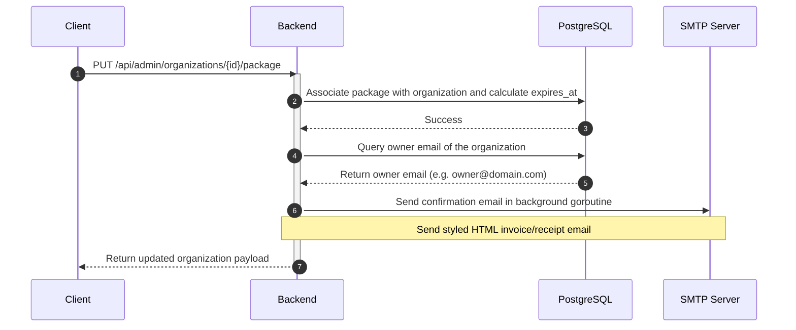

# Implementation Plan: Subscription Packages Management Module with Email Confirmations

This plan details the implementation of a full-fledged **Subscription Packages Management Module** from the backend to the frontend. Rather than managing subscription packages as hardcoded text tiers on organizations, this module introduces a dedicated database model (`subscription_packages`) that system administrators can create, edit, delete, and link to organizations. 

Additionally, this plan incorporates **automatic email confirmations** sent to the organization owner whenever a package is assigned or purchased.

---

## Technical Architecture

The following diagram illustrates how the packages and organizations tables are related, and how the administration flow handles assigning a package to an organization and triggering the email purchase receipt:



---

## Proposed Changes

### 1. Backend Database Schema & GORM Models

#### [NEW] [package.go](file:///Users/phatho/Projects/Personal/ARCH-TECH-CAD/autocard/backend/models/package.go)
Create a GORM model representing the subscription packages:
```go
package models

import "time"

type SubscriptionPackage struct {
	ID           string    `json:"id" gorm:"type:uuid;primaryKey;default:gen_random_uuid()"`
	Name         string    `json:"name" gorm:"type:varchar(255);not null;unique"` // e.g. "Pro Yearly"
	Code         string    `json:"code" gorm:"type:varchar(50);not null;unique"`  // e.g. "pro-yearly"
	Price        float64   `json:"price" gorm:"type:decimal(10,2);not null;default:0"`
	DurationDays int       `json:"duration_days" gorm:"not null;default:30"`
	MaxMembers   int       `json:"max_members" gorm:"not null;default:5"`
	MaxDrawings  int       `json:"max_drawings" gorm:"not null;default:10"`
	Features     string    `json:"features" gorm:"type:text;not null;default:''"` // Comma-separated list
	CreatedAt    time.Time `json:"created_at"`
	UpdatedAt    time.Time `json:"updated_at"`
}

type AssignPackageRequest struct {
	PackageID string `json:"package_id"`
}
```

#### [MODIFY] [organization.go](file:///Users/phatho/Projects/Personal/ARCH-TECH-CAD/autocard/backend/models/organization.go)
- Add `SubscriptionPackageID` and `SubscriptionPackage` association to the `Organization` GORM struct:
  ```go
  SubscriptionPackageID *string              `json:"subscription_package_id" gorm:"type:uuid;column:subscription_package_id;index"`
  SubscriptionPackage   *SubscriptionPackage `json:"subscription_package,omitempty" gorm:"foreignKey:SubscriptionPackageID;constraint:OnDelete:SET NULL"`
  ```

#### [NEW] [004_create_packages.sql](file:///Users/phatho/Projects/Personal/ARCH-TECH-CAD/autocard/backend/migrations/004_create_packages.sql)
Raw SQL migration queries:
- Create `subscription_packages` table.
- Alter `organizations` table to add foreign key column `subscription_package_id`.
- Seed default packages:
  - `Free Tier` (`free`, Price: 0, Max Members: 3, Max Drawings: 5)
  - `Pro Monthly` (`pro-monthly`, Price: 29.00, Max Members: 15, Max Drawings: 100)
  - `Enterprise Plan` (`enterprise-annual`, Price: 299.00, Max Members: 999, Max Drawings: 999)

#### [MODIFY] [migrate/main.go](file:///Users/phatho/Projects/Personal/ARCH-TECH-CAD/autocard/backend/cmd/migrate/main.go)
- Add `&models.SubscriptionPackage{}` to GORM `AutoMigrate()`.

---

### 2. Backend Repository Layer

#### [MODIFY] [organization_repo.go](file:///Users/phatho/Projects/Personal/ARCH-TECH-CAD/autocard/backend/repository/organization_repo.go)
Add GORM-based subscription packages operations and owner query helper:
- `CreatePackage(pkg *models.SubscriptionPackage) error`
- `GetAllPackages() ([]models.SubscriptionPackage, error)`
- `UpdatePackage(id string, pkg *models.SubscriptionPackage) error`
- `DeletePackage(id string) error`
- Modify `GetAllOrganizations()` to preload the `SubscriptionPackage` association.
- Modify `UpdateSubscription(orgID string, packageID string, expires *time.Time) error` to set `subscription_package_id` and update organization details.
- Add `GetOrganizationOwner(orgID string) (*models.User, error)` to find the owner user of the organization.

---

### 3. Backend HTTP Handlers & Router

#### [MODIFY] [admin_handler.go](file:///Users/phatho/Projects/Personal/ARCH-TECH-CAD/autocard/backend/handlers/admin_handler.go)
Create HTTP handlers for packages CRUD and assigning package to organization:
- `GET /api/admin/packages` -> `ListPackages`
- `POST /api/admin/packages` -> `CreatePackage`
- `PUT /api/admin/packages/{id}` -> `UpdatePackage`
- `DELETE /api/admin/packages/{id}` -> `DeletePackage`
- `PUT /api/admin/organizations/{id}/package` -> `AssignPackage` (updates organization's package and computes new expiration date. In addition, fetches organization owner and triggers asynchronous email confirmation via SMTP).
- Add helper method `sendPackagePurchaseEmail(toEmail, orgName, packageName string, expires *time.Time, price float64)` to format and send the confirmation receipt.

#### [MODIFY] [main.go](file:///Users/phatho/Projects/Personal/ARCH-TECH-CAD/autocard/backend/main.go)
- Register the new HTTP handlers and route paths. Protect all package modifications with the `RequireSystemAdmin` middleware.

---

### 4. Frontend Client API

#### [MODIFY] [client.ts](file:///Users/phatho/Projects/Personal/ARCH-TECH-CAD/autocard/frontend/src/api/client.ts)
Expose the admin packages wrapper methods:
```typescript
export const admin: Record<string, (...args: any[]) => Promise<any>> = {
  // ...
  getPackages: () => apiRequest("/api/admin/packages"),
  createPackage: (body) => apiRequest("/api/admin/packages", { method: "POST", body: JSON.stringify(body) }),
  updatePackage: (id, body) => apiRequest(`/api/admin/packages/${id}`, { method: "PUT", body: JSON.stringify(body) }),
  deletePackage: (id) => apiRequest(`/api/admin/packages/${id}`, { method: "DELETE" }),
  assignPackage: (orgId, body) => apiRequest(`/api/admin/organizations/${orgId}/package`, { method: "PUT", body: JSON.stringify(body) }),
};
```

---

### 5. Frontend Admin Console UI

#### [MODIFY] [AdminConsolePage.tsx](file:///Users/phatho/Projects/Personal/ARCH-TECH-CAD/autocard/frontend/src/pages/AdminConsolePage.tsx)
- Add a new tab **"Packages"** to the top selection bar.
- **Packages Tab Content**:
  - Display a grid/table showing all available subscription plans with columns for Name, Price, Cycle, Member limit, Drawing limit, and features list.
  - Include an edit/delete button for each package, and a **"Create Package"** form button.
- **Create/Edit Package Modal**:
  - Form fields for: Package Name, Unique Code, Price ($), Duration (Days), Max Members, Max Drawings, and Features (comma-separated).
- **Organizations Tab updates**:
  - Update the "Edit Subscription" modal. Instead of a text input, fetch all packages using `admin.getPackages()` and display a selection dropdown.
  - When a package is selected, automatically compute and display the proposed expiration date (`time.Now() + package.duration_days`).
  - Clicking "Apply" invokes `admin.assignPackage(...)` to save the association and trigger the notification flow.

---

## Verification Plan

### Automated Checks
- Verify backend compiles:
  ```bash
  go test ./...
  ```
- Verify typescript checks:
  ```bash
  npx tsc --noEmit
  ```
- Verify frontend bundle builds:
  ```bash
  npm run build
  ```

### Manual Verification
1. Log in as system admin (`user@example.com`). Open the **Admin Console** page.
2. Click the new **Packages** tab. Verify the default seeded packages (Free, Pro, Enterprise) load from the DB.
3. Click "Create Package", specify "Premium Monthly" (`premium-monthly`, Price: $49, Duration: 30 days, Max Members: 30, Max Drawings: 200, Features: 3D modeling, offline exports).
4. Verify the new package appears in the list.
5. Go to the **Organizations** tab, click "Manage Package" on an organization.
6. Select "Premium Monthly" from the dropdown. Confirm the calculated expiration date displays correctly.
7. Click "Apply". Confirm the organization now shows the active "premium-monthly" package and expiration period.
8. Check backend console logs to verify that the mock SMTP email was dispatched:
   `[DEV] Subscription Purchase Email to user@example.com: Package "Premium Monthly" activated for Organization "Acme CAD Studio" (Price: $49.00, Expires: Date).`
9. Delete the created package and verify it cleans up gracefully.
