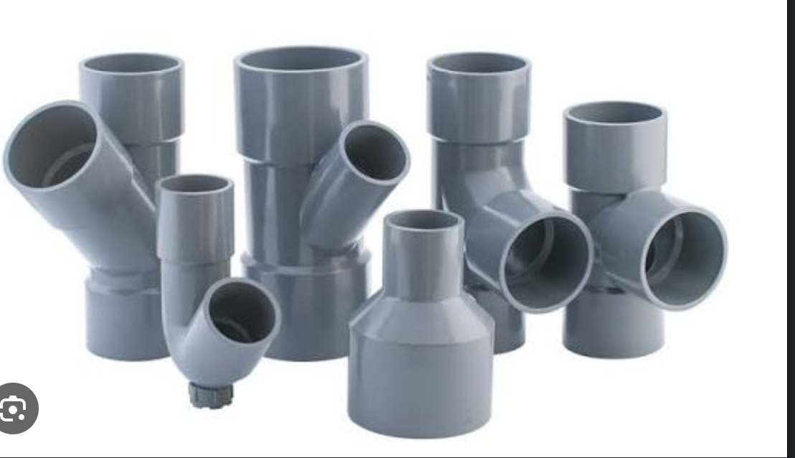
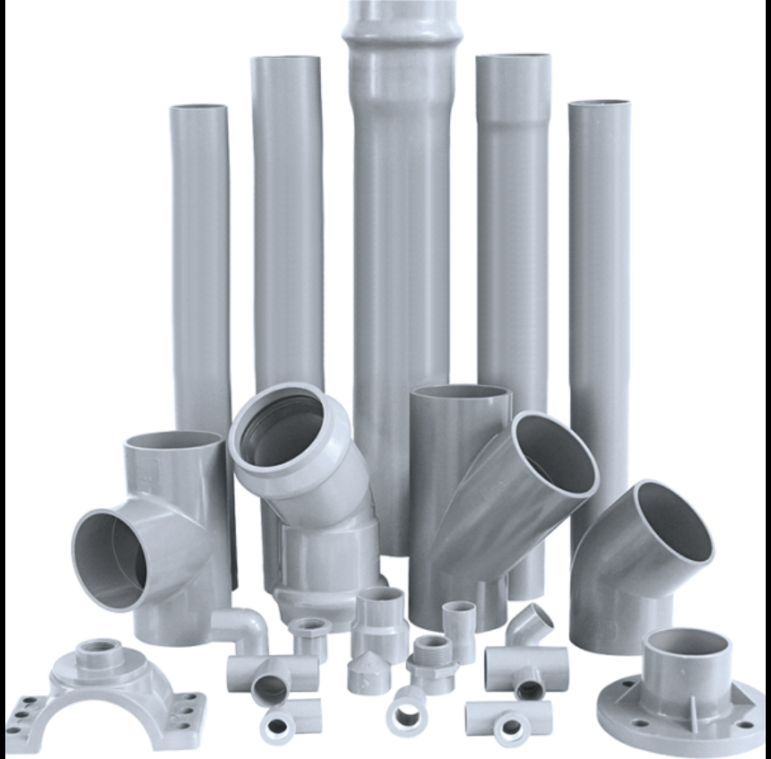
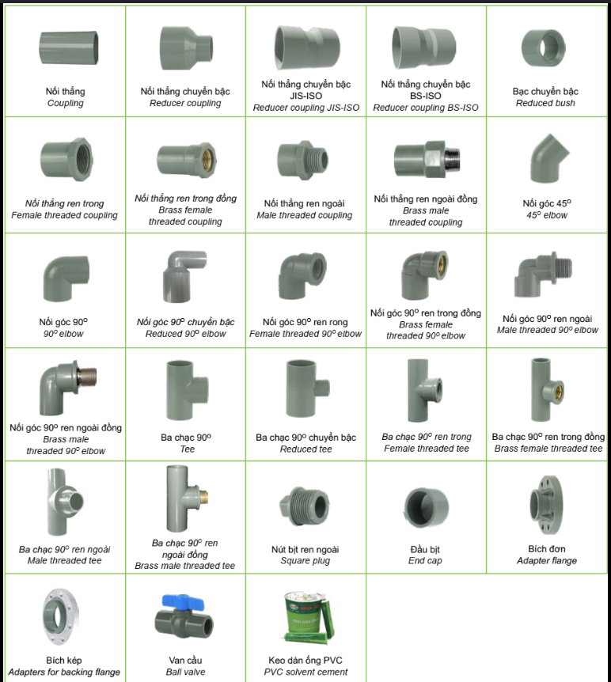
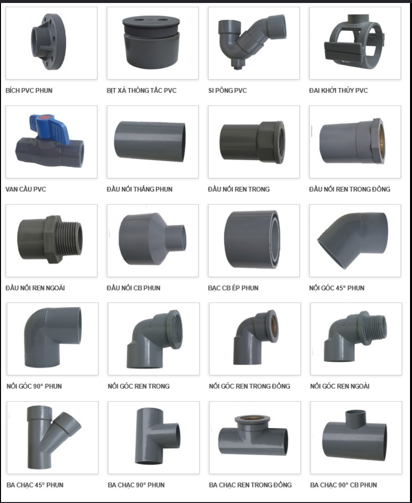
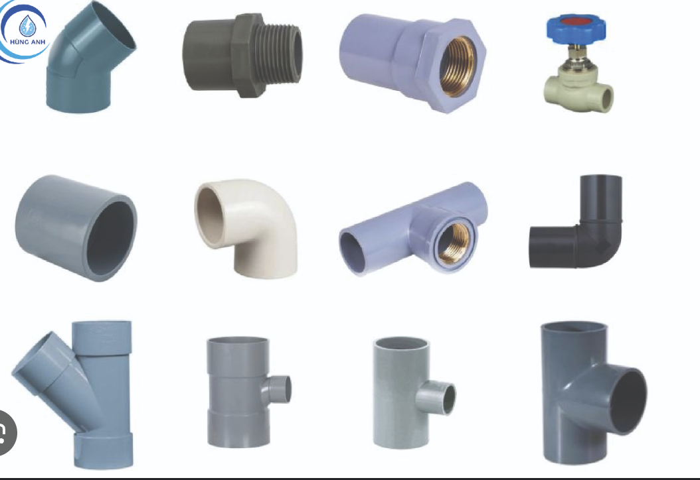

# PVC Pipe Fittings Reference — shapes, materials, placement

Source: user-supplied documents attached 2026-07-07 as the modeling reference for the MEP 3D pipe work (plan `2026-07-06-3d-drawing-tools.md`, Tasks 17–18, and the design spec's Phase 9 stretch goal of catalog-accurate fittings): `Phu_kien_ong_nuoc_PVC.html` ("Phụ kiện ống nước PVC – Hình dáng, Vật liệu, Vị trí lắp đặt" — the catalog condensed below), plus two working Three.js viewers copied alongside this file — [`pvc-fittings-3d-viewer.html`](pvc-fittings-3d-viewer.html) (all 20 water/drainage fittings) and [`electric-conduit-3d-viewer.html`](electric-conduit-3d-viewer.html) (electric conduit, wiring, and devices).

PVC (uPVC) fittings connect, redirect, reduce, branch, cap, or shut off flow in supply/drainage/irrigation systems. They are injection-molded from virgin PVC-U, typically grey (drainage/supply uPVC) or off-white/light blue-grey (PVC-U / heat-resistant CPVC lines). Plain (socket) ends are solvent-welded; threaded ends — often with molded-in brass inserts — go where disassembly or metal equipment connections are needed.

## Fitting catalog

### Straight runs and couplings

| Fitting (VN / EN) | Shape | Placement / use |
|---|---|---|
| Ống PVC / straight pipe | Round cylinder, 4–6 m lengths; one end often pre-belled (đầu bát) to socket the next pipe | Main supply, waste, rainwater runs; embedded in walls/slabs or on risers |
| Nối thẳng / coupling | Short tube, two equal sockets, internal center stop ridge | Joins two same-diameter pipes to extend a straight run or replace a damaged section |
| Nối thẳng chuyển bậc / reducer coupling (JIS-ISO, BS-ISO) | Stepped cylinder, one large end + one small end | Transition between a main and a smaller branch |
| Bạc chuyển bậc / reduced bush | Short bush: large OD seats inside the big pipe, small ID accepts the small pipe | Inserted into an oversized tee/elbow socket to step the diameter down |

### Threaded couplings (plain and brass-insert)

| Fitting (VN / EN) | Shape | Placement / use |
|---|---|---|
| Nối thẳng ren trong / female threaded coupling | One solvent socket + one internal thread; premium versions have a molded-in brass thread insert | Connects PVC to male-threaded equipment: taps, water meters, metal valves |
| Nối thẳng ren ngoài / male threaded coupling | One solvent socket + one external thread (optionally brass-reinforced) | Screws into female-threaded stubs: valve boxes, brass elbows, tanks |
| Nối góc 90°/45° ren (lõi đồng) / threaded elbow, brass insert | 90° or 45° bend, one solvent end + one threaded end with brass core | Direction change where threaded equipment mounts: before showers, flush valves, meters |
| Ba chạc ren (lõi đồng) / threaded tee, brass insert | T-shape, two in-line solvent ends + one perpendicular threaded (brass) branch | Branch off a main while accepting a threaded device (valve, tap, pressure sensor) |

### Elbows and tees

| Fitting (VN / EN) | Shape | Placement / use |
|---|---|---|
| Nối góc 45° / 45° elbow | 45° bend, two solvent sockets, molded in one piece | Gentle direction change; preferred on drainage to reduce flow friction |
| Nối góc 90° / 90° elbow | Right-angle bend, two sockets; reducing variant exists | Direction change at wall corners, risers up/down |
| Ba chạc 90° / tee | T-shape, three sockets: two in-line + one perpendicular | Splits a run into two branches at distribution points |
| Ba chạc 90° chuyển bậc / reducing tee | T-shape with a smaller-diameter branch | Small branch off a larger main, e.g. per-room supply take-offs |
| Ba chạc 45° / wye (Y, tê xiên) | Y-shape, branch at 45° to the main axis | Drainage branches — smoother flow, less sediment/blockage at the junction |

### Caps, plugs, and cleanouts

| Fitting (VN / EN) | Shape | Placement / use |
|---|---|---|
| Đầu bịt / end cap | Round dome cap, one closed end + one solvent socket | Permanently seals an unused branch or line terminus |
| Nút bịt ren ngoài / square plug | Screw plug with square/hex drive head, external thread | Screws into female threads for temporary or serviceable sealing |
| Bịt xả thông tắc / cleanout cap | Short body with a central screw-off lid, sits flush on the drain line | On waste lines for rodding/inspection without cutting pipe |
| Si phông / P-trap | P- or U-shaped bend holding a water seal | Directly under fixtures (lavabo, floor drain) to block sewer odor and insects |

### Flanges, clamps, and valves

| Fitting (VN / EN) | Shape | Placement / use |
|---|---|---|
| Bích đơn / adapter flange | Round disc with bolt holes + one solvent stub | Connects PVC to flanged equipment: pumps, industrial valves, tanks |
| Bích kép / backing-flange adapter | Two symmetric flange faces joined by a short spool | Frequently-disassembled flange-to-flange joints |
| Đai khởi thủy / pipe clamp | Half-round saddle ring with bolt lugs | Fixes/supports runs along walls, ceilings; prevents sag and vibration |
| Van cầu, van bi / ball valve | Cylindrical body with a lever or wheel handle (blue/red), solvent or threaded ends | Shut-off/regulation at equipment inlets, meters, isolation points |

### Adhesive and high-pressure variants

| Item | Notes |
|---|---|
| Keo dán ống / solvent cement | Solvent (THF, MEK) in a metal can with brush; chemically welds plain joints into one piece — all non-threaded joints use it |
| Phụ kiện phun / injection high-pressure line | Same shapes (flange, coupling…) but thicker-walled high-pressure moldings for outdoor mains and irrigation |

## Selection notes (from the source doc)

- Plain-end fittings are solvent-welded — permanent joints for fixed systems. Threaded fittings go where things must come apart or meet metal equipment.
- Brass-insert threads survive repeated assembly far better than plain PVC threads; use them at important equipment connections.
- Match diameter (DN/Ø), thread standard (JIS, BS…), and pressure class (Class 5/6…) to the main line.

## Mapping to 3D geometry (for Phase 9 / post-v1 fitting upgrade)

The v1 fittings (plan Task 18) are schematic: sphere at bends, box for electric, valve/cleanout/diffuser at ends. This catalog is the reference for the stretch goal of catalog-accurate PVC shapes.

**Working prototype (water/drainage — complete catalog):** [`pvc-fittings-3d-viewer.html`](pvc-fittings-3d-viewer.html) — a user-supplied standalone Three.js (r128) viewer that builds **all 20 catalog fittings** as primitive assemblies, with a diameter slider (Ø20–60mm) and orbit controls. Open it in a browser to inspect each shape. Its `build(type)` function is the authoritative geometry recipe; port the decompositions below into `MepFittingMesh` (they're plain `CylinderGeometry`/`TorusGeometry`/`SphereGeometry` — no r128-specific APIs). Reusable helpers in the prototype: `stubCollar` (bell socket ring), `threadRidges` (stacked brass torus rings suggesting threads), `boltRing` (6 brass bolts on a `1.85r` circle).

Recipes, parameterized by pipe radius `r` (viewer uses `r = 0.34` scene units ≡ Ø34mm; scale linearly). The signature detail shared by every solvent-weld end is the **bell socket ring** — an open-ended cylinder `1.18r` radius × `0.4` long in the darker PVC material — which is what makes the shapes read as real fittings rather than raw tubes. Thread ridges are `TorusGeometry(1.05·r_thread, tube 0.025)` rings spaced 0.06 apart in brass:

| Fitting | Prototype decomposition |
|---|---|
| Straight pipe | Cylinder `r` × 3.2 long + one bell ring (đầu bát) at one end |
| Coupling | Two pipe stubs + center sleeve cylinder `1.22r` × 1.1 long (darker material — reads as the molded body with its internal stop ridge) |
| Reducer | Stub `r` + stub `0.62r` + tapered cylinder (`1.1r` → `0.71r`, 1.2 long) between them |
| Reduced bush | Face ring `1.25r` × 0.3 + tapered cone (`1.25r` → `0.55r`, 1.0 long) + inner stub `0.55r` |
| Female threaded coupling (brass) | Pipe stub + body sleeve `1.22r` × 1.1 + open brass cylinder `0.92r` × 0.9 set inside the threaded end |
| Male threaded coupling (brass) | Pipe stub + bell collar + solid brass cylinder `0.95r` × 0.9 + 8 thread ridges |
| Threaded elbow (brass) | 90° torus elbow (below) with one leg replaced by a brass `0.95r` × 0.9 threaded branch + 6 ridges |
| Threaded tee (brass) | Through-pipe + hub sphere `1.28r` + vertical brass `0.95r` × 0.9 threaded branch + 6 ridges |
| Elbow 90° | `TorusGeometry(bendR = 2.1r, tube = r, arc = π/2)` + a 1.3-long leg stub tangent to each arc end + bell ring on each leg |
| Elbow 45° | Same but `bendR = 2.6r`, `arc = π/4`; the outgoing leg is rotated 45° (see the prototype's `ex/ey` math for placing it tangent to the arc end) |
| Tee | Through-pipe `r` × 3.2 + perpendicular branch `r` × 1.5 + center hub sphere `1.28r` (hides the intersection seam) + bell rings on all three ends |
| Reduced tee | Same but branch `0.6r`, hub sphere `1.2r`, smaller bell ring on the branch |
| Wye 45° (tê xiên) | Through-pipe + branch `r` × 1.4 rotated 45° off-axis + hub sphere `1.25r` + bell rings — use for `pipeSystem: "drain"` joints instead of a 90° tee |
| End cap | Stub + closed cylinder `1.2r` × 0.7 + hemisphere `1.2r` closing the far end |
| Square plug | Threaded cylinder `0.95r` × 0.9 with 8 ridges + hex head (`CylinderGeometry` with 6 radial segments, `1.35r` × 0.35) |
| Cleanout cap | Wide cylinder `1.3r` × 0.6 + face disc `1.3r` × 0.15 + brass octagonal nut (`0.55r`, 8 segments) raised in the center |
| P-trap (si phông) | Vertical inlet stub + `TorusGeometry(1.6r, tube = r, arc = π)` half-loop + vertical outlet stub + bell rings |
| Flange | Stub + disc `2.3r` radius × 0.32 thick + bolt ring |
| Backing flange | Two discs `2.3r` × 0.3 at both ends + center pipe `r` × 1.2 + a bolt ring on each disc |
| Pipe clamp | Pipe + metal saddle `TorusGeometry(1.28r, tube 0.08, arc = 1.5π)` + base plate box + screw cylinder |
| Ball valve | Two stubs + body cylinder `1.6r` × 1.3 (blue) + brass stem cylinder + red lever `BoxGeometry(0.75, 0.14, 0.22)` + bell rings |

Materials (`MeshStandardMaterial`): PVC body `#8b96a0` roughness 0.55 / metalness 0.08; socket/bell rings and molded bodies in a darker `#6d7883`; brass (thread inserts, ridges, bolts, valve stem) `#c79a4b` metalness 0.8; valve body blue `#2f6fb0`; handle red `#d8442e`; clamp metal `#9aa0a6` metalness 0.7. The existing per-system `SYSTEM_COLORS` tinting can stay as an overlay so systems remain distinguishable.

## Electrical conduit & devices (for `pipeSystem: "electric"`)

**Working prototype:** [`electric-conduit-3d-viewer.html`](electric-conduit-3d-viewer.html) — the user-supplied companion viewer for the electrical system, 10 models with a Ø16–32mm slider (base `r = 0.28` ≡ Ø20mm). Its key idea is showing the **wires inside the conduit**: cutaway pipes expose three colored cores following the VN convention — phase L red `#d8442e`, neutral N blue `#2f6fb0`, earth PE green `#4f8f2e` (each core = cylinder radius 0.045, `addWireBundle` spaces them in a triangle).

| Model | Prototype decomposition |
|---|---|
| Rigid conduit (cutaway) | Partial cylinder (`CylinderGeometry` with `thetaStart -0.15π, thetaLength 1.5π`) exposing the 3-core wire bundle running through, collars at both ends; cream fire-resistant PVC `#e8ddc9` |
| Flexible conduit (ruột gà, cutaway) | Stack of alternating rings `r` / `1.18r` (0.16 long, spaced 0.18) forming the corrugation, same cutaway arc, wire bundle inside |
| 90° elbow with wire | Torus elbow (`bendR = 2.4r`) + leg stubs + a single red wire as `TubeGeometry` along a `CatmullRomCurve3` threaded through the bend and poking out both ends |
| Junction box (open, Wago) | Open-top box (floor + 4 wall slabs, 1.7 × 0.35 × 1.2) + conduit stub entering one side + 3 colored wires meeting at Wago lever connectors (small cylinders, orange `#d9832e` / grey) |
| Box connector | Conduit stub + collar `1.3r` × 0.5 + metal locknut ring (`1.5r` → `1.4r` tapered cylinder) |
| Mini distribution board | Open box 2.0 × 1.6 × 0.5 + metal DIN rail + 5 MCB breakers (dark `#2b2b2b` body, red lever, white label) + brass busbar strip + door swung open |
| Wall switch | Face plate 1.1 × 1.6 × 0.12 + body + tilted rocker + 4 corner screws, with the wire bundle arriving behind |
| Socket outlet | Face plate + round face cylinder + 2 pin holes + earth pin + screws, wire bundle behind |
| Multicore cable + crimp lug | Translucent sheath (`opacity 0.55`) over 3 splayed cores + copper (`#d08a4f`, metalness 0.85) crimp lug: cylinder barrel + torus ring eye |
| Saddle clip | Conduit + metal `TorusGeometry(1.2r, tube 0.07, arc = 1.4π)` saddle + base box |

For the Task 18 upgrade this replaces the plain box at electric joints/ends: bends get the junction box (real conduit turns corners through a box), runs can render as conduit (optionally cutaway with cores for a "show wiring" mode), and open ends get a switch, socket, or distribution board depending on context.

Two integration notes when porting into `MepFittingMesh`:
- Elbows need the incoming/outgoing direction vectors of the two segments meeting at the joint (to orient the torus arc and pick π/2 vs π/4) — exactly the extra data the spec's Phase 9 flagged as the reason v1 uses a sphere. `computeMepJoints` would need to also return the two segment directions at each joint.
- The prototype's stubs/bells sit at fixed local offsets because each fitting is displayed in isolation; in the scene, legs should extend along the actual segment directions and the adjoining `PipeMesh` cylinders should be shortened (or simply overlapped) so pipe and fitting don't z-fight.

## Reference photos

Extracted from the source HTML (appendix "Phụ lục hình ảnh tham khảo — dùng dựng mô hình 3D/BIM"). Use for shape/proportion reference; get exact dimensions (Ø, length, thread pitch) from manufacturer catalogues.

| File | Content |
|---|---|
|  `pvc-fittings-1.png` | Wyes, reducing tees, 45° elbows, reducer couplings — one-piece grey uPVC moldings |
|  `pvc-fittings-2.png` | Straight belled pipe with fitting set: tee, 45° elbow, threaded coupling, adapter flange, male threaded coupling |
|  `pvc-fittings-3.png` | Bilingual VN/EN catalog sheet: couplings, reducers (JIS-ISO/BS-ISO), bush, threaded couplings (plain & brass), elbows 45°/90°, tees, plugs, caps, flanges, ball valve, solvent cement |
|  `pvc-fittings-4.png` | Injection-molded (PHUN) line: flanges, cleanout, P-trap, pipe clamp, ball valve, threaded couplings, elbows, tees/wyes |
|  `pvc-fittings-5.png` | Material/color variants: grey/white/black elbows, brass-insert male couplings and tees, couplings, wye |
