# ARCH-TECH-CAD — System Workflow & Architecture

> **Version**: 1.0  
> **Last Updated**: 2026-05-31  
> **Stack**: Go + PostgreSQL + Redis (Backend) · React + TypeScript + Vite (Frontend) · Three.js (3D)

---

## Table of Contents

1. [System Architecture Overview](#1-system-architecture-overview)
2. [Authentication Flow](#2-authentication-flow)
3. [Application Navigation Flow](#3-application-navigation-flow)
4. [Drawing Lifecycle](#4-drawing-lifecycle)
5. [2D Canvas Rendering Pipeline](#5-2d-canvas-rendering-pipeline)
6. [3D Viewer Pipeline](#6-3d-viewer-pipeline)
7. [AI Drawing Generation Flow](#7-ai-drawing-generation-flow)
8. [Real-Time Collaboration Flow](#8-real-time-collaboration-flow)
9. [Block Library & Furniture System](#9-block-library--furniture-system)
10. [Organization Management Flow](#10-organization-management-flow)
11. [RAG Knowledge Base Flow](#11-rag-knowledge-base-flow)
12. [State Management Architecture](#12-state-management-architecture)
13. [Data Models](#13-data-models)

---

## 1. System Architecture Overview

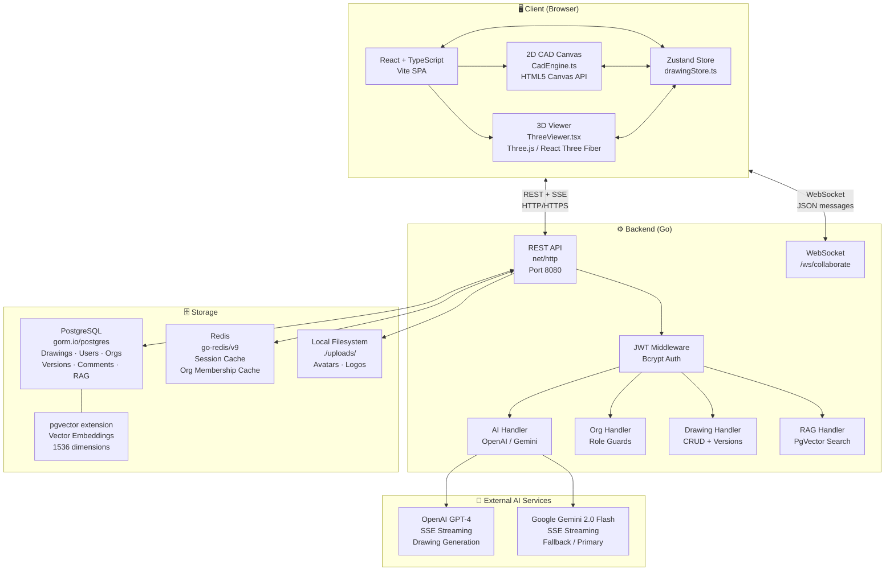

---

## 2. Authentication Flow

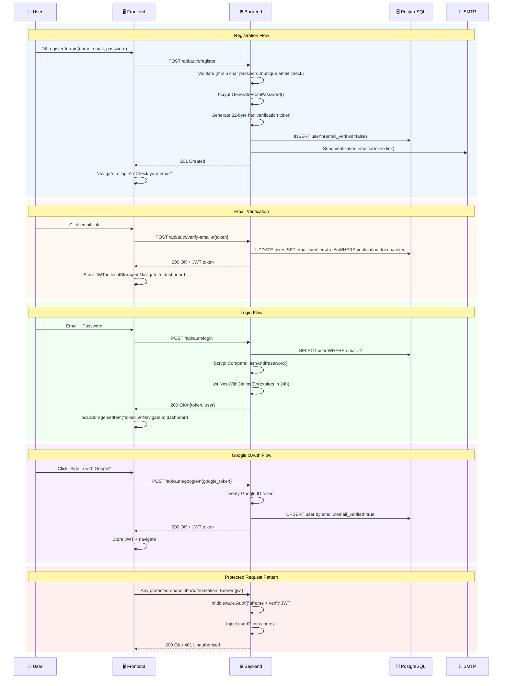

---

## 3. Application Navigation Flow

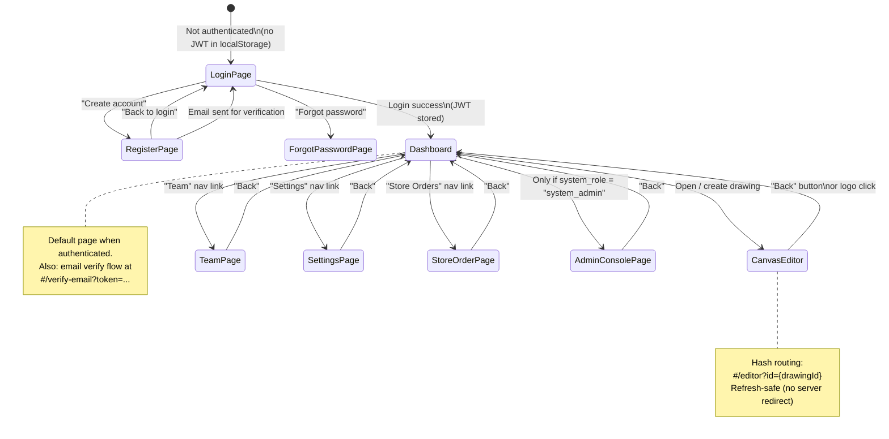

**Hash Routing Table:**

| Route (URL Hash) | Page Component | Auth Required |
|---|---|---|
| `#/login` | `LoginPage` | No |
| `#/register` | `RegisterPage` | No |
| `#/forgot-password` | `ForgotPasswordPage` | No |
| `#/verify-email?token=` | Inline handler | No |
| `#/dashboard` | `DrawingDashboard` | ✅ Yes |
| `#/editor?id={uuid}` | `CanvasEditor` | ✅ Yes |
| `#/settings` | `SettingsPage` | ✅ Yes |
| `#/team` | `TeamPage` | ✅ Yes |
| `#/store-orders` | `StoreOrderPage` | ✅ Yes |
| `#/admin` | `AdminConsolePage` | ✅ system_admin only |

---

## 4. Drawing Lifecycle

```mermaid
flowchart TD
    A([🏠 Dashboard]) -->|"Click 'New Drawing'"| B[POST /api/drawings\nname: 'Untitled']
    A -->|"Click existing card"| C[Load Drawing\nGET /api/drawings/id]

    B --> D[Navigate to\n#/editor?id=uuid]
    C --> D

    D --> E{{"⚙️ CanvasEditor\nMounted"}}
    E --> F[loadDrawing\nfetch elements from JSONB]
    F --> G[Hydrate Zustand store\nelements, layers, blockDefs]
    G --> H[CadEngine renders\n2D canvas]
    G --> I[ThreeViewer renders\n3D scene]

    H --> J{{"🖊 User draws / edits"}}
    J --> K[updateElement / addElement\nin Zustand store]
    K --> L[Canvas re-renders\nvia RAF loop]
    K --> M{autoSave\ndebounced 2s}
    M -->|"PUT /api/drawings/id"| N[(PostgreSQL\ndata JSONB updated)]
    N --> O[version_history\nrecord saved]

    J --> P{{"Undo / Redo"}}
    P -->|"Ctrl+Z"| Q[Pop history stack\nrestore elements[]]
    P -->|"Ctrl+Y"| R[Advance historyIndex]

    H --> S{{"Export"}}
    S -->|"SVG"| T[Generate SVG string\nfrom elements]
    S -->|"PNG"| U[canvas.toDataURL]
    S -->|"DXF"| V[dxfExporter.ts\nDXF format string]
    S -->|"JSON"| W[JSON.stringify elements]

    style E fill:#1e40af,color:#fff
    style J fill:#065f46,color:#fff
    style S fill:#7c3aed,color:#fff
```

---

## 5. 2D Canvas Rendering Pipeline

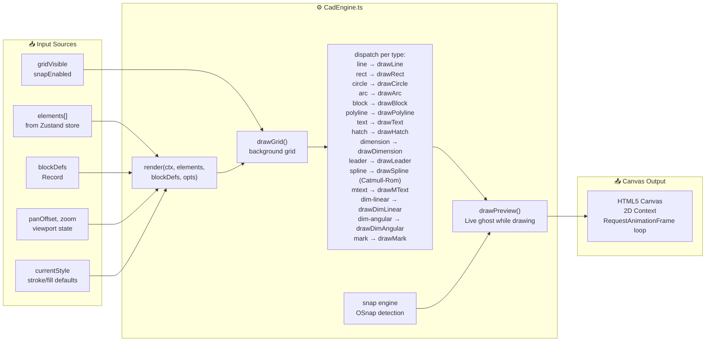

**Element Type → Renderer Map:**

| Element Type | Renderer | Key Properties |
|---|---|---|
| `line` | `drawLine` | x1, y1, x2, y2, lineType (solid/dashed/dotted) |
| `rectangle` | `drawRect` | x, y, width, height, fillColor, strokeColor |
| `circle` | `drawCircle` | cx, cy, radius, fillColor |
| `arc` | `drawArc` | cx, cy, radius, startAngle, endAngle |
| `polyline` | `drawPolyline` | points[], closed |
| `spline` | `drawSpline` | points[] (Catmull-Rom bezier) |
| `text` | `drawText` | x, y, text, fontSize, fontFamily |
| `mtext` | `drawMText` | x, y, text (multiline, `\n` separated) |
| `block` | `drawBlock` | blockId, x, y, scale, rotation |
| `hatch` | `drawHatch` | points[], pattern, fillColor |
| `dimension` | `drawDimension` | x1,y1,x2,y2, offset |
| `dim-linear` | `drawDimLinear` | x1,y1,x2,y2, dimAxis (h/v) |
| `dim-angular` | `drawDimAngular` | vertex, point1, point2 |
| `leader` | `drawLeader` | points[], text |
| `mark` | `drawMark` | x, y, markNumber |
| `wall` | via `polyline` | archType="wall", wallThickness |
| `door` | via `arc`+`rect` | archType="door", swing |
| `window` | via `rect` | archType="window" |

---

## 6. 3D Viewer Pipeline

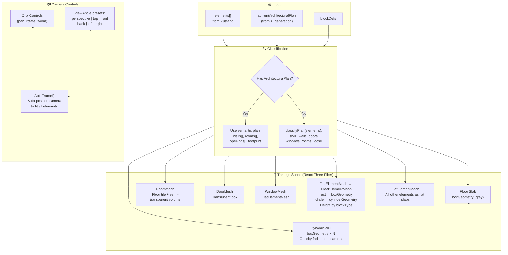

**Block Height in 3D:**

| Block Type | 3D Height (canvas units) |
|---|---|
| `door` | 20 |
| `window` | 10 |
| `car` | 18 |
| All other blocks | 8 (flat) |
| Walls | `wallHeight` (configurable, default ~25) |

---

## 7. AI Drawing Generation Flow

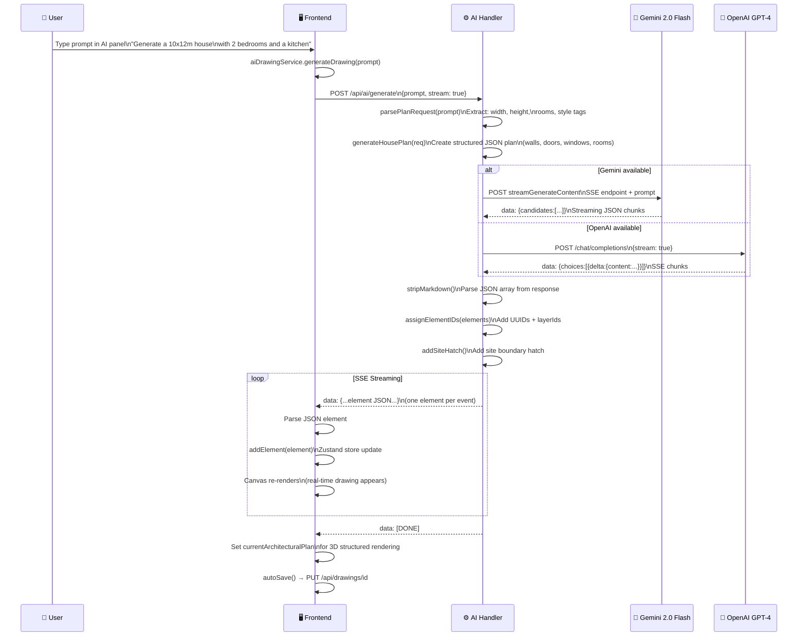

---

## 8. Real-Time Collaboration Flow

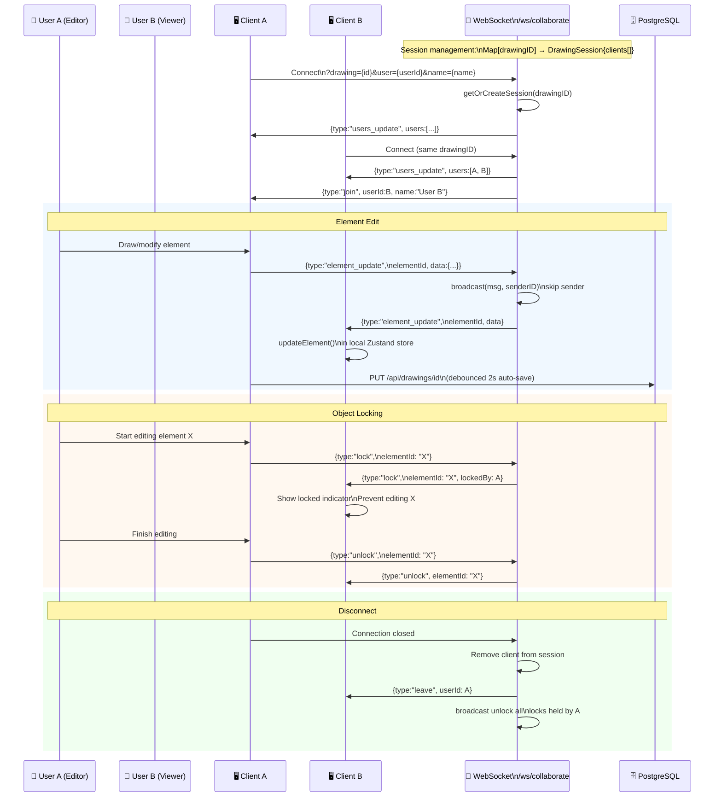

**WebSocket Message Types:**

| Type | Direction | Payload |
|---|---|---|
| `join` | Server → Clients | `{userId, name}` |
| `leave` | Server → Clients | `{userId}` |
| `users_update` | Server → Client | `{users: [{id, name}]}` |
| `element_update` | Client ↔ Server | `{elementId, data}` |
| `element_add` | Client ↔ Server | `{element}` |
| `element_delete` | Client ↔ Server | `{elementId}` |
| `lock` | Client ↔ Server | `{elementId}` |
| `unlock` | Client ↔ Server | `{elementId}` |

---

## 9. Block Library & Furniture System

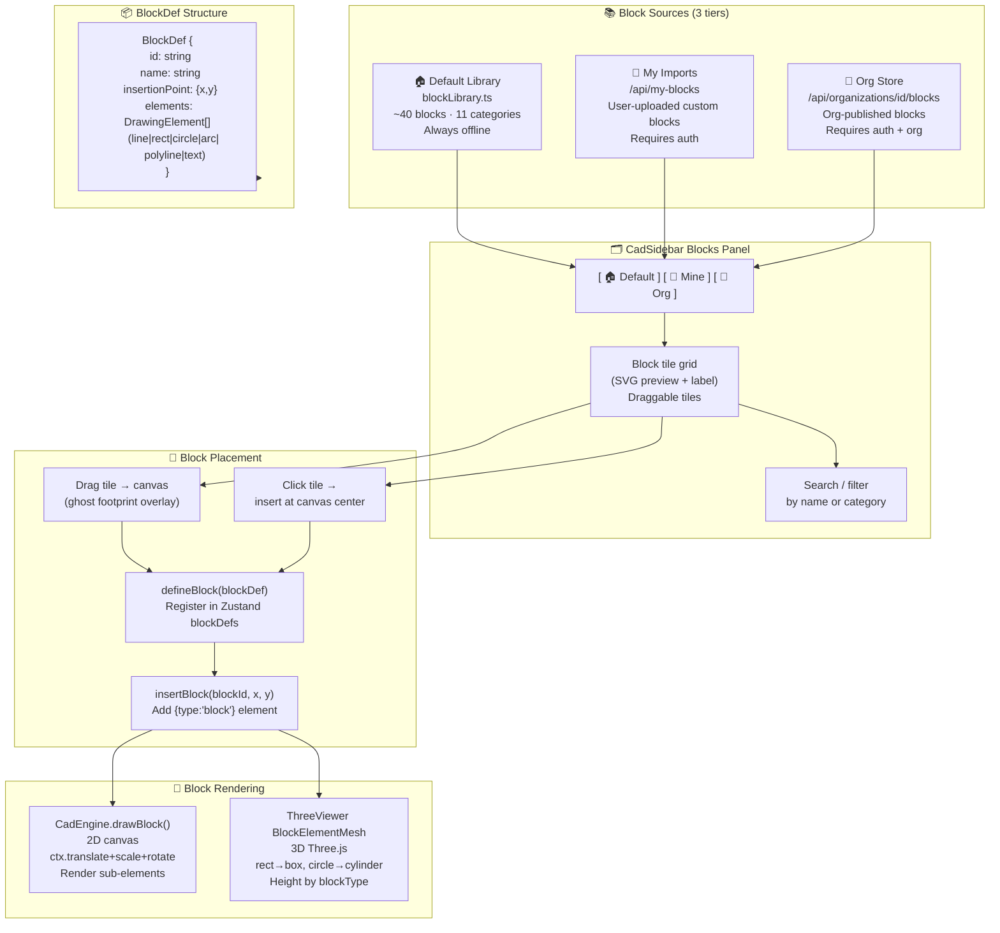

**Block Categories:**

| Category | Blocks | Icon |
|---|---|---|
| Living Room | sofa, sofa-l, armchair, coffee-table, tv-unit, bookshelf, rug, floor-lamp | 🛋 |
| Bedroom | bed, bed-single, wardrobe, dresser, nightstand | 🛏 |
| Dining | dining-table-rect, table (round), dining-chair | 🍽 |
| Kitchen | sink, stove, refrigerator, kitchen-counter, oven, kitchen-sink-double | 🍳 |
| Bathroom | toilet, bath, shower, bidet, sink, sink-double | 🚿 |
| Office | desk, desk-l, chair, conference-table, printer | 🖥 |
| Structural | column-sq, column-rnd, stair, elevator, ramp, door, window | ⬛ |
| Electrical | outlet, switch, ceiling-light, ac-unit, smoke-detector | ⚡ |
| Landscape | plant, tree, car, parking, swimming-pool | 🌳 |
| Elevation | windows, arched-window, column elevations | 🏛 |
| Annotation | bubbles, arrows, north arrow, room tags | 📍 |

---

## 10. Organization Management Flow

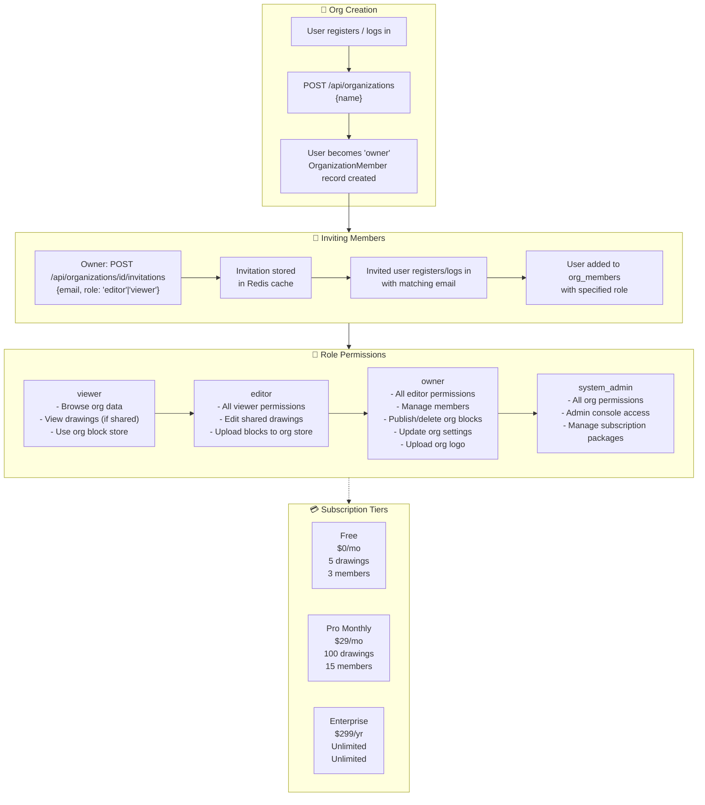

---

## 11. RAG Knowledge Base Flow

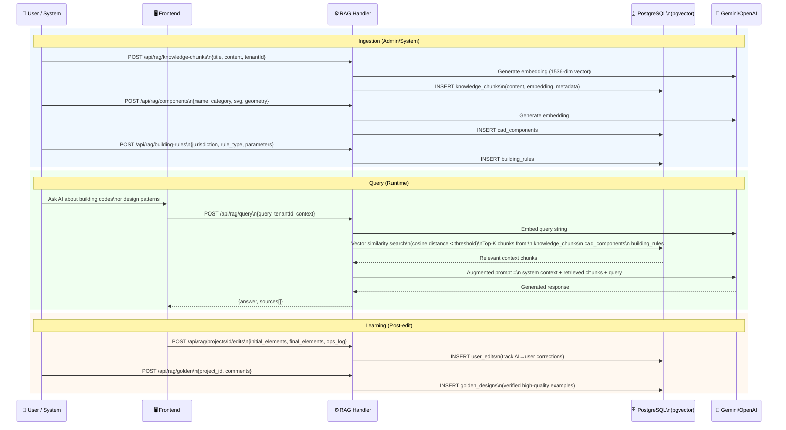

---

## 12. State Management Architecture

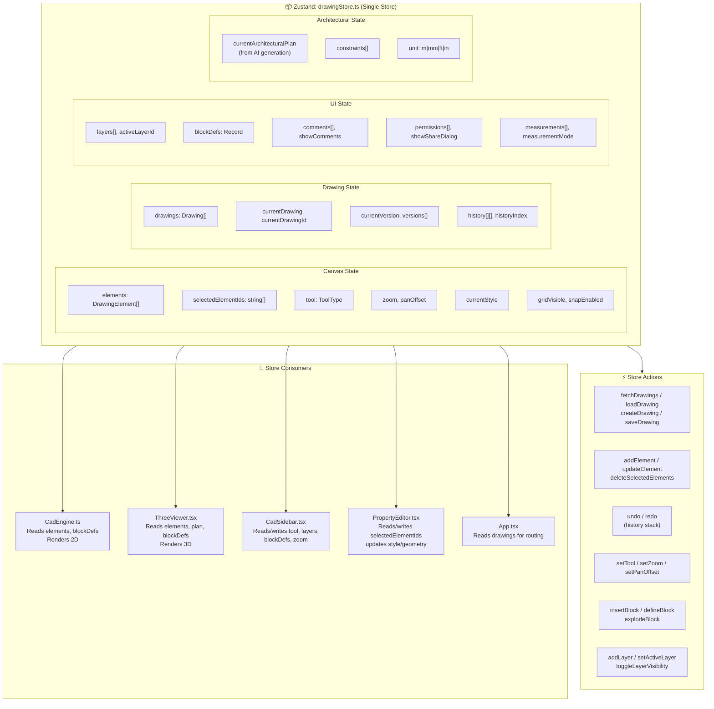

---

## 13. Data Models

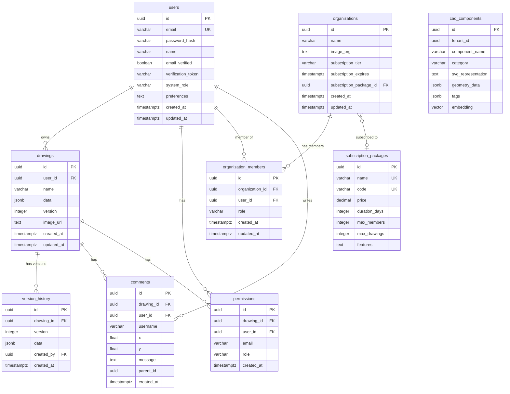

---

## Appendix: Technology Versions

| Component | Technology | Version |
|---|---|---|
| Frontend Framework | React | 18.x |
| Frontend Language | TypeScript | 5.x |
| Frontend Build | Vite | 5.x |
| State Management | Zustand | 4.x |
| 3D Rendering | Three.js + React Three Fiber | Latest |
| Backend Language | Go | 1.24 |
| Backend HTTP | net/http (stdlib) | Go 1.22+ patterns |
| ORM | GORM | gorm.io/gorm |
| Database | PostgreSQL | 15+ (with pgvector) |
| Cache | Redis | 7.x |
| Auth | JWT (golang-jwt/jwt v5) | v5 |
| Realtime | Gorilla WebSocket | v1 |
| Password Hashing | bcrypt (golang.org/x/crypto) | latest |
| AI (primary) | Google Gemini 2.0 Flash | API v1beta |
| AI (fallback) | OpenAI GPT-4 | API v1 |
| Vector Search | pgvector | 0.5+ |

---

*Generated by ARCH-TECH-CAD documentation system · 2026-05-31*
