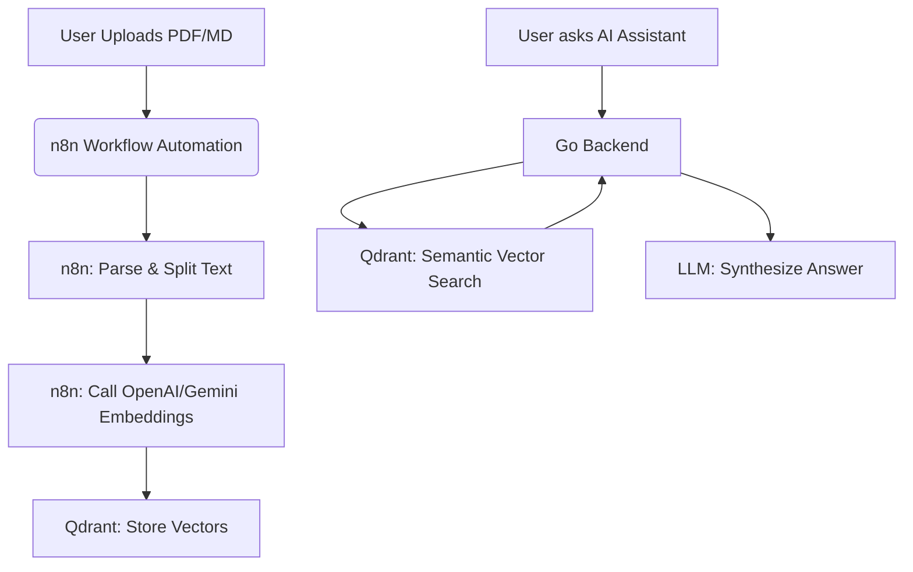

# Guide: Workflow Automation with n8n & Vector Search with Qdrant

This document provides instructions on setting up and integrating **n8n** and **Qdrant** into the AutoCard architecture to scale your RAG (Retrieval-Augmented Generation) document pipeline and automate background workflows.

---

## 1. Architectural Overview

Instead of parsing files and storing vector embeddings in Postgres (`pgvector`) synchronously inside the Go backend, we can offload these tasks to **n8n** and **Qdrant**:



- **n8n**: Automates the ingestion pipeline (File upload $\rightarrow$ Text Parsing $\rightarrow$ Chunking $\rightarrow$ Embedding Generation $\rightarrow$ Storage).
- **Qdrant**: Replaces `pgvector` as a dedicated, high-performance vector database.

---

## 2. Docker Deployment

Create a `docker-compose.yml` to run both services locally:

```yaml
version: '3.8'

services:
  qdrant:
    image: qdrant/qdrant:latest
    container_name: qdrant-vector-db
    ports:
      - "6333:6333"
      - "6334:6334"
    volumes:
      - qdrant_storage:/qdrant/storage
    restart: always

  n8n:
    image: docker.n8n.io/n8nio/n8n:latest
    container_name: n8n-automation
    ports:
      - "5678:5678"
    environment:
      - N8N_SECURE_COOKIE=false
    volumes:
      - n8n_storage:/home/node/.n8n
    restart: always

volumes:
  qdrant_storage:
  n8n_storage:
```

Run the stack:
```bash
docker-compose up -d
```

---

## 3. Qdrant Integration

### A. Core Concepts
- **Collection**: Equivalent to a DB table (e.g. `knowledge_chunks`).
- **Point**: An entry containing an `id`, a `vector` (float array), and a `payload` (JSON metadata).
- **Distance**: Similarity metric (typically `Cosine` or `Dot`).

### B. Creating a Collection (REST API)
Initialize the collection using `1536` dimensions (matching OpenAI's `text-embedding-3-small` / `text-embedding-ada-002` dimensions):

```bash
curl -X PUT http://localhost:6333/collections/knowledge_chunks \
  -H 'Content-Type: application/json' \
  -d '{
    "vectors": {
      "size": 1536,
      "distance": "Cosine"
    }
  }'
```

### C. Replacing pgvector queries in Go
Import the Qdrant Go client: `github.com/qdrant/go-client/qclient` or call Qdrant's HTTP JSON API. Here is the query replacement pattern:

```go
// Replace pgvector with Qdrant Vector Search
func (r *RAGRepo) QdrantVectorSearch(embedding []float32, limit int) ([]models.KnowledgeChunk, error) {
    url := "http://localhost:6333/collections/knowledge_chunks/points/search"
    
    requestBody, _ := json.Marshal(map[string]interface{}{
        "vector": embedding,
        "limit":  limit,
        "with_payload": true,
    })

    resp, err := http.Post(url, "application/json", bytes.NewBuffer(requestBody))
    if err != nil {
        return nil, err
    }
    defer resp.Body.Close()

    // Parse response points and map payloads to models.KnowledgeChunk
    ...
}
```

---

## 4. n8n Workflow Automation

n8n offers a visual node editor to build pipelines. You can create a workflow that triggers whenever a file is uploaded or sent to an email.

### Example Workflow: PDF/Markdown Ingestion
1. **Webhook Node**: Receives file uploads via `POST /webhooks/ingest-document`.
2. **Read Binary File**: Parses the `.txt`, `.md`, or `.pdf` file.
3. **Item Lists / Split In Batches**: Segments the text into chunks of 800 characters.
4. **OpenAI Node**: Generates vector embeddings for each chunk.
5. **Qdrant Node**: Inserts the vector and text chunk (payload) into the Qdrant collection.

### Benefits of n8n
- **No-Code / Low-Code Parsing**: Supports PDF parsers, HTML crawlers, and Markdown splitters natively.
- **Easy LLM Chaining**: Drag-and-drop nodes for OpenAI, Claude, vector stores, and custom JavaScript transforms.
- **Scheduling**: Poll building code sites daily for updates and automatically re-index Qdrant vectors.
