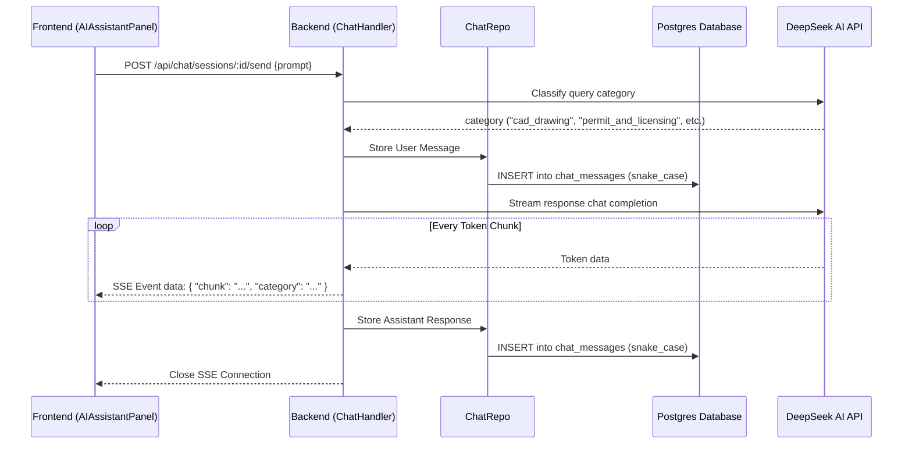

# Walkthrough: Persistent Chat Sessions, SSE Streaming, and Prompt Classification

## Summary
Implemented a session-based chat architecture with Server-Sent Events (SSE) streaming for real-time token delivery and a query classification system to analyze and route user requests.

---

## Files Added & Changed

### Backend

#### [NEW] [chat.go](file:///Users/phatho/Projects/Personal/ARCH-TECH-CAD/autocard/backend/models/chat.go)
Contains database models for chat sessions and messages using GORM.
- **`ChatSession`**: Defines a conversation thread mapped to a user.
- **`ChatMessage`**: Represents an individual message (user or assistant role) in a session.
- Both models strictly enforce snake_case fields (e.g., `user_id`, `session_id`).

#### [NEW] [chat_repo.go](file:///Users/phatho/Projects/Personal/ARCH-TECH-CAD/autocard/backend/repository/chat_repo.go)
Repository layer to encapsulate CRUD database operations for:
- Creating, deleting, and fetching chat sessions.
- Appending messages and retrieving session history.

#### [NEW] [chat_handler.go](file:///Users/phatho/Projects/Personal/ARCH-TECH-CAD/autocard/backend/handlers/chat_handler.go)
HTTP handler managing sessions, SSE streams, and routing logic:
- `/api/chat/sessions` (GET / POST): List and create sessions.
- `/api/chat/sessions/:id` (DELETE): Delete a session.
- `/api/chat/sessions/:id/messages` (GET): Retrieve session history.
- `/api/chat/sessions/:id/send` (POST): Processes user queries using an LLM-based classifier to identify query category (`cad_drawing`, `permit_and_licensing`, `construction_materials`, or `general_knowledge`), streaming chunks back via SSE.

#### [MODIFY] [main.go](file:///Users/phatho/Projects/Personal/ARCH-TECH-CAD/autocard/backend/main.go)
- Initializes `ChatRepo` and `ChatHandler`.
- Performs GORM auto-migrations for `ChatSession` and `ChatMessage`.
- Configures authentication-protected API endpoints for chat session management.

---

### Frontend

#### [NEW] [chatService.ts](file:///Users/phatho/Projects/Personal/ARCH-TECH-CAD/autocard/frontend/src/services/chatService.ts)
A helper service interfacing with the backend chat session API endpoints:
- Session CRUD calls (`listSessions`, `createSession`, `deleteSession`, `getMessages`).
- Handles SSE chunk parsing by reading the response stream chunk-by-chunk and emitting token updates.

#### [MODIFY] [AIAssistantPanel.tsx](file:///Users/phatho/Projects/Personal/ARCH-TECH-CAD/autocard/frontend/src/panels/AIAssistantPanel.tsx)
Redesigned the AI Assistant layout:
- **Session History Sidebar**: Slides out from the side showing saved sessions with quick actions (new session, delete session, switch sessions).
- **SSE Streaming Integration**: Displays assistant response tokens in real-time as they stream from the server.
- **Category Badge**: Renders a custom badge for each response indicating its classification category (`✏️ CAD Drawing`, `📋 Permits & Codes`, `🧱 Materials`, or `General`).
- Preserves all pre-existing functionality (draft generation, local RAG hooks, direct DXF file parser uploads).

---

## Architecture Flow



---

## Verification & Testing

### Automated Checks
- Verified that the backend compiles cleanly:
  ```bash
  cd autocard/backend && go build ./...
  ```
- Executed Go tests to ensure handler routing and dependencies pass:
  ```bash
  cd autocard/backend && go test ./...
  ```
- Verified that the frontend compiles cleanly under TypeScript (no warnings/errors):
  ```bash
  cd autocard/frontend && npx tsc --noEmit
  ```

### Manual Integration Testing
1. **Database Migration**:
   - Start the backend via `go run main.go`. Look at startup logs to confirm auto-migration of `chat_sessions` and `chat_messages` tables succeeded.
2. **Session Creation & Sidebar**:
   - Start the frontend, log in, and open the AI Assistant Panel.
   - Click the **History** button to toggle the sidebar.
   - Create a few test sessions and toggle/switch between them. Verify delete functionality removes the session and clears local message state.
3. **SSE Streaming & Classification**:
   - Type a prompt related to permits, e.g., "What are the permit requirements for building a wooden deck?".
   - Verify that:
     1. The answer streams in word-by-word (tokens).
     2. A yellow **Permits & Codes** category badge is displayed.
     3. Switching sessions preserves the message history and fetches correct context from `/api/chat/sessions/:id/messages`.

---

## Token Context Limit Mitigation
When working with very large drawings (e.g. detailed floor plans imported from DXF/DWG files), serializing the entire element list into the prompt for LLMs (OpenAI, DeepSeek, Gemini) can easily exceed the context length (which can reach over 1 million tokens). 

To prevent this error, we introduced a smart element pruning strategy:
- **`pruneElements` in `ai_edit_handler.go`**:
  - Automatically activates if the drawing has more than 400 elements.
  - Prioritizes architectural elements (`wall`, `door`, `window`, `room`, `floor`, `grid`, `dimension`) which are necessary for spatial reasoning and snapping.
  - Fills the remaining budget with non-architectural elements (lines, circles, etc.) up to a maximum threshold of **800 elements** (roughly 30k tokens).
  - This ensures that the AI model always receives the structural context it needs to execute edits without crashing the request due to context limits.
- **Unit Tests**:
  - Implemented inside `ai_edit_handler_test.go` to verify small drawings pass unchanged, structural prioritization works, and drawings exceeding the limit are safely trimmed.

---

## Unified AI Interact Routing Endpoint
We renamed the `/api/ai/edit` endpoint to `/api/ai/interact` and refactored the backend structure to serve as a central routing gateway for all AI assistant requests:
- **Prompt Classification**:
  - When the user submits a prompt, the `/api/ai/interact` endpoint first classifies it using the classifier agent (`cad_drawing`, `permit_and_licensing`, `construction_materials`, or `general_knowledge`).
- **Unified Routing**:
  - If the prompt is `cad_drawing`, it runs the CAD edit/generate prompt pipeline, returning a set of JSON canvas commands and a text summary.
  - If the prompt is a RAG category (`permit_and_licensing`, `construction_materials`) or `general_knowledge`, it runs the text completion with the selected system prompt and returns the answer text in the `summary` field (leaving `commands` empty).
- **Clean Frontend Implementation**:
  - The frontend now submits prompts directly to `interactDrawingFromPrompt`. It no longer checks keywords locally; instead, it waits for the server's classification and renders the text answer directly (and applies drawing updates if CAD commands are present in the response).

---

## Floating Command AI Chat Integration
We integrated the prompt answers directly inside the floating **Command AI** panel on the canvas:
- **Local Message History**:
  - Added a scrollable list of messages inside [AiCommandBox.tsx](file:///Users/phatho/Projects/Personal/ARCH-TECH-CAD/autocard/frontend/src/pages/CanvasEditor/components/AiCommandBox.tsx) right below the header.
  - Automatically scrolls to the bottom of the conversation when new messages are added.
- **Removed Modal Alerts**:
  - Replaced the browser alert dialogs (which previously threw an informational box saying *"AI analyzed the request but suggested no changes..."* with the raw string) with clean user and assistant message bubbles.
  - Generative layout changes and edit commands are executed on the canvas in the background while adding a status log directly to the chat bubble history.

---

## State Preservation & Resizable Chat Panels
We introduced state preservation on page refreshes and added manual resizing capabilities for the floating command box:
- **State Preservation on Refresh**:
  - **Main Assistant Panel**: Saves the last selected `activeChatSessionId` in `localStorage`. On component mount (page refresh), it automatically retrieves this session and fetches its message history from the backend database.
  - **Floating Command Box**: Saves the local list of chat messages and the current panel width/height to `localStorage`. On refresh, it loads them so that the user doesn't lose context.
- **Drag-to-Resize Command Panel**:
  - Added absolute positioned drag handles on the **left border**, **top border**, and **top-left corner** of the floating `COMMAND AI` panel.
  - Users can click and drag these edges/corners to dynamically resize the width and height of the box (with safe boundaries between 260px–600px width and 220px–700px height).
  - The chat message container flexes dynamically, adapting its scrollable viewport to the resized box height.

---

## Command AI Database Persistence
We unified the database message tracking between the main assistant sidebar and the floating canvas command box:
- **Session ID Propagation**:
  - The floating box retrieves the currently active chat session ID from `localStorage`.
  - When calling `/api/ai/interact`, it passes this session ID to the server.
- **Backend Message Logs splitting**:
  - If a session ID is received, the `/api/ai/interact` handler saves the user's prompt as a `user` role message.
  - After routing and executing the classification prompt, the handler saves the generated AI text (along with any executed CAD commands stringified) as an `assistant` role message.
  - This ensures that messages sent from the canvas floating box are persistently logged in the active database session history.

## Chat Duplication Fixes, In-Memory Synchronization & RAG History Context

We implemented final refinements to the chat architecture, fixing duplication bugs, unifying active sessions across components, and feeding previous conversation history to AI interaction flows.

---

### 🛠️ What We Accomplished

#### 1. Enter Key Duplication Prevention
- **Issue**: Pressing Enter inside the floating `COMMAND AI` box previously fired multiple events or caused concurrent asynchronous state updates, leading to duplicate requests and duplicated message bubbles.
- **Fix**:
  - Bound `e.preventDefault()` inside `handleKeyDown` in [AiCommandBox.tsx](file:///Users/phatho/Projects/Personal/ARCH-TECH-CAD/autocard/frontend/src/pages/CanvasEditor/components/AiCommandBox.tsx) to stop browser event bubbling/duplication.
  - Implemented a React Ref guard (`isGeneratingRef.current`) to block any duplicate keypresses or click events in the same execution frame.
  - Added early checks to return immediately if AI processing is already active.

#### 2. Pure In-Memory Chat Session Synchronization & Global Scoping
- **Issue**: The sidebar panel and the floating box each managed their own local active session ID and chat history state, leading to inconsistent chat histories. Additionally, sessions were previously isolated and filtered by `drawing_id`, preventing the user from continuing a single unified conversation across different CAD layouts.
- **Fix**:
  - Removed all `drawingId` parameters from `listSessions()`, `createSession()`, and `loadSessions()` inside the frontend store and services.
  - Chat sessions are now fully global. Users can continue the same chat thread, review code compliance calculations, and query RAG materials seamlessly regardless of which CAD drawing is active.
  - Created a global Zustand store [chatStore.ts](file:///Users/phatho/Projects/Personal/ARCH-TECH-CAD/autocard/frontend/src/stores/chatStore.ts).
  - Both components now share the exact same list of messages, active session ID, and loading states.
  - **No localStorage or sessionStorage usage**: Strictly complies with the user requirement to store nothing in client-side storage objects. All synchronization is in-memory, and data is re-hydrated dynamically from the database.

#### 3. Backend Conversation History Context in AI Interact Flows
- **Issue**: The `/api/ai/interact` endpoint did not feed previous messages of the active session to the LLM (meaning RAG codes safety checks, material calculations, and canvas edit reasoning were completely stateless).
- **Fix**:
  - Updated [ai_edit_handler.go](file:///Users/phatho/Projects/Personal/ARCH-TECH-CAD/autocard/backend/handlers/ai_edit_handler.go) to fetch historical messages of the session via `ListMessages(req.SessionID)` before committing the new prompt.
  - Implemented `callLLMWithHistory` routing queries with historical context.
  - Added native Gemini history payload formatter `callGeminiWithHistory` structuring system instructs and multi-turn contents cleanly.
  - Added OpenAI and DeepSeek compatible handlers to route multi-turn history.

---

### 🧪 Verification & Compilation
1. **Backend Build**:
   ```bash
   cd autocard/backend && go build ./...
   ```
   *Result*: Compilation completed successfully with zero warnings/errors.
2. **Backend Unit Tests**:
   ```bash
   cd autocard/backend && go test ./...
   ```
   *Result*: Tests passed successfully.
3. **Frontend TypeScript Check**:
   ```bash
   cd autocard/frontend && npx tsc --noEmit
   ```
   *Result*: Type checks passed successfully.
